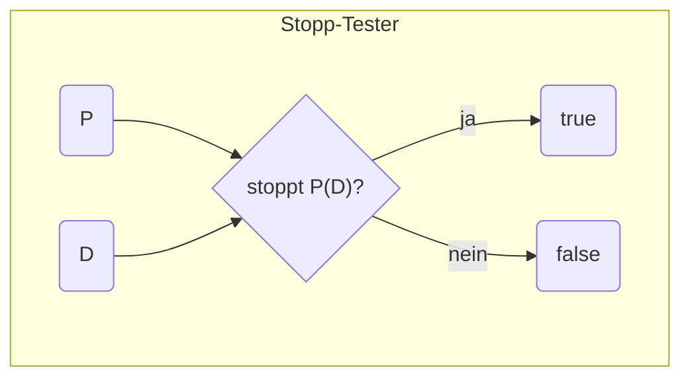
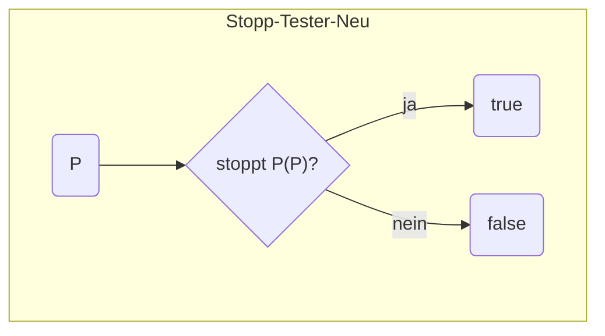
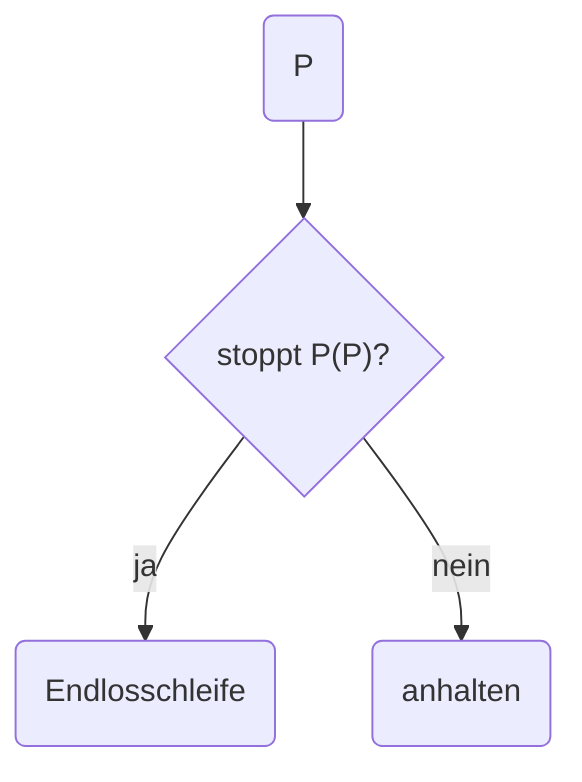
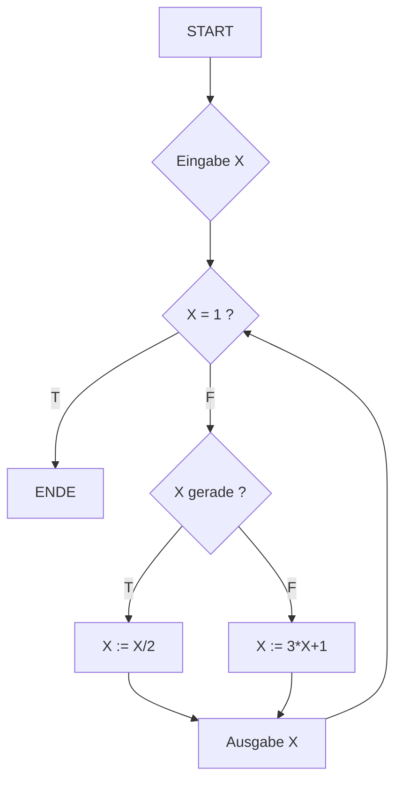

## 6.1 Entwurfsprobleme

Aus verschiedenen Gründen kann der Entwurf eines Algorithmus zu einem gegebenen Problem unmöglich sein.

- Inkonsistenz:
  das Problem birgt einen Widerspruch
- Unentscheidbarkeit: prinzipiell algorithmisch unlösbar
- Ineffektivität: mit den gegebenen Hilfsmitteln algorithmisch unlösbar
- Ineffizienz: praktisch unlösbar. (Es gibt zwar einen effektiven Algorithmus, der aber nicht in akzeptabler Zeit und mit tragbaren Kosten fertig wird.)
- Mehrdeutigkeit: wenn zu einem Input mehrere Outputs möglich sind, muss entschieden werden, ob die Ausgabe aus einem oder allen möglichen Outputs oder aus einer Anforderung nach Präzisierung bestehen soll.
- Komplexität: ein Problem (z.B. Mustererkennung) kann so komplex sein, dass ein Ansatz zu einer algorithmischen Lösung nicht in Sicht ist.

## 6.2 Aufgaben

- Probleme haben Eingaben (Parameter) und Ausgaben.
- Werte für Eingaben konkretisieren das Problem zu einer Aufgabe.
- Meist soll eine unendliche Schar gleichartiger Aufgaben (Problem) gelöst werden.
- Problem formuliert Zusammenhang zwischen Eingabe und Ausgabe.
- Ausgaben sind das Ziel der Lösung von Problemen. Oft genügt es, eine korrekte Ausgabe zu berechnen, egal wie viele es gibt.
- Zur Lösung von Aufgaben (Problemen) werden Algorithmen gesucht/entwickelt/benutzt.
- Zentrales Thema der Informatik ist die Formulierung und Realisierung von Algorithmen.

## 6.3 Probleme

Wir betrachten Probleme, bei denen:

*   Eingaben und Ausgaben aus getrennten, zählbaren Bereichen stammen
*   jede Eingabe zu einer eindeutig bestimmten Ausgabe führt

Ein Problem kann als **partielle Funktion** $f: E \rightarrow A$ dargestellt werden. Hierbei ist $E$ die Menge der möglichen Eingaben und $A$ die Menge der möglichen Ausgaben.

Eine **partielle Funktion** $f: E \rightarrow A$ bedeutet:
* $f$ ist eine Menge von Paaren $(x, y)$, wobei $x$ eine Eingabe aus $E$ und $y$ die zugehörige Ausgabe aus $A$ ist. Mathematisch: $f \subseteq E \times A$
* für jede Eingabe $x$ gibt es höchstens eine Ausgabe $y$. Das heißt, wenn $(x, y) \in f$ und $(x, y') \in f$, dann muss $y = y'$ gelten

Eine **totale Funktion** $f: E \rightarrow A$ ist eine spezielle partielle Funktion, bei der:
* für *jede* mögliche Eingabe $x$ aus $E$ *immer* eine Ausgabe $y$ in $A$ existiert. Mathematisch: $\forall x \ \exists \ y \ [x, y] \in f$

Warum ist eine Funktion partiell? Weil nicht jede Kombination von Eingabewerten eine Ausgabe haben muss. Bsp.: Division durch 0.

## 6.4 Funktionen

Eine **Funktion** ist eine Relation $R \subseteq M \times N$ zwischen einem Definitionsbereich $M$ (auch Argumentbereich genannt) und einem Wertebereich $N$. Eine Funktion muss folgende Eigenschaften erfüllen:

1. jedes Element aus dem Definitionsbereich $M$ ist mit höchstens einem Element aus dem Wertebereich $N$ verbunden (**rechts-eindeutig**)
2. jedes Element von $M$ ist mit einem Element aus $N$ verbunden (**linkstotal**)

Die Eigenschaft der **Rechts-Eindeutigkeit** bedeutet, dass ein Element der Eingabemenge $M$ nicht zu mehreren Elementen der Ausgabemenge $N$ führen kann. Wenn nur diese Bedingung (1.) erfüllt ist, sprechen wir von einer **partiellen Funktion**, wie sie bereits in Abschnitt 6.3 definiert wurde.

Die Eigenschaft der **Linkstotalität** bedeutet, dass jedes Element im Definitionsbereich $M$ eine entsprechende Ausgabe im Wertebereich $N$ haben muss. Wenn sowohl die Rechts-Eindeutigkeit als auch die Linkstotalität erfüllt sind, spricht man von einer **totalen Funktion**.

### 6.4.1 Notation

**Funktions-Schreibweise**
- statt $f \subseteq M \times N$ wird oft geschrieben: $f: M \rightarrow N$
- oder statt $(x, y) \in f$ wird geschrieben: $f(x) = y$
- oder statt $(x, y) \in f$ wird geschrieben: $x \mapsto y \in f$

**Definitions-Schreibweisen**
- seien $M_1 = \{a, b, c, d\}$ und $M_2 = \{1, 2, 3\}$
- Bsp.: $f: M_1 \rightarrow M_2 = \{(a, 1), (b, 3), (c, 2), (d, 3)\}$

**Rekursive Definition**
- eine Funktion kann auch rekursiv definiert werden
- Bsp.:
$$f(x) = \begin{cases}
        1, & \text{falls } x = 0 \\
        1, & \text{falls } x = 1 \\
        f(x/2), & \text{falls } x \ge 2 \text{ und } x \text{ gerade} \\
        f(3x+1), & \text{falls } x \ge 2 \text{ und } x \text{ ungerade}
        \end{cases}$$
### 6.4.2 Arten

**![[Pasted image 20251201190136.png]]

## 6.5 Algorithmen

Mathematische Funktionen sind häufig *deklarativ* definiert, d.h. sie enthalten keine Angaben zur Durchführung ihrer Berechnung.

*   Bsp. für Funktionsdefinitionen: $f(n, m) = n+m$, $f(n) = n!$
*   Wie kann ein Algorithmus den Funktionswert $f(w)$ berechnen
*   Können alle berechenbaren Probleme derart gelöst werden

Grundidee:
*   Ein Algorithmus wird durch eine Funktion $f$ realisiert
*   Die Eingabe des Algorithmus ist ein Element $w$ aus dem Definitionsbereich von $f$
*   Die Ausgabe des Algorithmus ist der Wert $f(w)$ aus dem Wertebereich von $f$

Bsp.: Eine Funktion kann definiert sein als $f: \mathbb{R} \rightarrow \mathbb{R}$ mit dem Definitionsbereich $D_f = \mathbb{R} \setminus \{0\}$ und der Funktionsvorschrift $f(x) = 1/x$

- Algorithmen können undefinierte Ausdrücke enthalten und müssen nicht in jedem Fall terminieren (Bsp.: Collatz-Zahlen), d.h.: Algorithmen berechnen partielle Funktionen
* Wenn der Definitionsbereich einer Funktion endlich ist, lässt sie sich durch Angabe aller Funktionswerte in einer Tabelle definieren

### 6.5.1 Definition

>Ein Algorithmus ist eine präzise, endliche Verarbeitungsvorschrift, die genau festlegt, wie die Instanzen einer Klasse von Problemen gelöst werden. Ein Algorithmus liefert eine Funktion (Abbildung), die festlegt, wie aus einer zulässigen Eingabe die Ausgabe ermittelt werden kann.

### 6.5.2 Eigenschaften

Ein Algorithmus ist eine präzise, in einer festen Sprache abgefasste Beschreibung eines allgemeinen Verfahrens.

1. endlich (endliche Formulierung)
2. vollständig (gibt alle relevanten Eigenschaften von Input und Output an)
3. präzise/eindeutig (unmissverständliche Anweisungsfolge)
4. elementar (elementare Anweisungen für ein ausführendes Organ – in der Informatik: Computer)
5. deterministisch (keine Wahlmöglichkeit)
6. terminierend (schließt nach endlich vielen Schritten ab)
7. universell (löst mehrere Probleme, für jede Eingabe ein Problem)

## 6.6 Abzählbarkeit

>Eine Menge M heißt abzählbar genau dann, wenn es eine Abbildung von den natürlichen Zahlen $\mathbb{N}$ in M gibt, bei der alle Elemente aus M als Bildelemente natürlicher Zahlen erfasst werden.

- D. h., die Elemente von M können durchnummeriert werden.
- Alle Elemente aus M müssen bei der Nummerierung erfasst werden. Wiederholungen sind bei der Nummerierung zugelassen.
- Endliche Mengen sind abzählbar
- Unendliche Mengen sind abzählbar (unendlich), wenn jedem Element eindeutig eine natürliche Zahl zugeordnet werden kann. Die Zuordnung muss nicht eineindeutig sein.

Mengen, bei denen es keine Abbildung nach obiger Definition gibt, heißen __überabzählbar__. Beispiel: reelle Zahlen

### 6.6.1 Abzählbare und aufzählbare Mengen

Definition: Eine Menge $M$ heißt aufzählbar, wenn es einen Algorithmus __Aufzählung__ gibt mit folgenden Eigenschaften:

1. __Aufzählung__ hat eine natürliche Zahl als Eingabe
2. __Aufzählung__ terminiert für jede natürliche Zahl
3. __Aufzählung__ liefert als Ergebnis ein Element der Menge $M$
4. Für jedes Element der Menge $M$ gibt es eine natürliche Zahl $i$, so dass Aufzählung mit $i$ als Eingabe dieses Element liefert

>Aufzählbare Mengen sind höchstens abzählbar (nicht überabzählbar)

Bsp. zum Unterschied zwischen abzählbar und aufzählbar:

Die Menge der Primzahlen ist aufzählbar, da ein Algorithmus existiert, der sie der Reihe nach erzeugen kann ($2, 3, 5, 7, \dots$)
Die Menge aller Computerprogramme, die für eine bestimmte Eingabe niemals enden, ist abzählbar (jedem Programm kann eine einzigartige Nummer zugewiesen werden), aber nicht aufzählbar, da es keinen Algorithmus gibt, der *genau diese* Programme der Reihe nach auflisten könnte, ohne auch Programme zu berücksichtigen, die doch irgendwann stoppen.

## 6.7 Kodierung von Algorithmen

Bei der Kodierung von Algorithmen werden folgende abzählbare Bereiche betrachtet:

*   natürliche, ganze und rationale Zahlen
*   Wörter über einem Alphabet
*   Listen, Bäume, Graphen mit abzählbaren Inhalten
*   ...

Diese Inhalte können entweder repräsentiert werden als:

*   Menge von Wörtern
*   Menge von Zahlen

Für die Behandlung dieser Konzepte ist es ausreichend, sich auf partielle zahlentheoretische Funktionen oder partielle Wortfunktionen zu beschränken.

## 6.8 Berechnung vs. Entscheidung

Eine **partielle Funktion** $f: E \rightarrow A$ wird als **Berechnungsproblem** bezeichnet. Bei einem Berechnungsproblem geht es darum, einen bestimmten Wert (die Ausgabe $A$) zu finden, der zu einer gegebenen Eingabe $E$ passt. Eine partielle Funktion bedeutet, dass nicht für jede mögliche Eingabe ein Ergebnis existieren muss.

Ein **Entscheidungsproblem** ist eine spezielle Art von Berechnungsproblem. Es hat zwei zusätzliche Bedingungen:
* die Funktion $f$ ist **total**, das heißt, sie liefert für *jede* mögliche Eingabe ein Ergebnis
* der Wertebereich $A = \{0, 1\}$ ist, das heißt, das Ergebnis ist immer entweder "Ja" (dargestellt durch 1) oder "Nein" (dargestellt durch 0)

Ein Entscheidungsproblem $f: E \rightarrow A$ kann man sich auch so vorstellen: es definiert eine Menge $M_f = \{x \mid x \in E, f(x) = 1\}$. Das sind alle Eingaben $x$, für die die Funktion "Ja" (1) als Antwort liefert. Die Frage ist dann: Gehört die gegebene Eingabe $x$ zu dieser speziellen Menge $M_f$?

Wir können Probleme danach unterscheiden, welche Art von Frage sie beantworten:
1.  **Ja-Nein-Fragen** (Entscheidungsprobleme): Hier sucht man eine klare Ja- oder Nein-Antwort. Ein Algorithmus, der diese Frage immer korrekt beantworten und dabei immer endet, ist **entscheidbar**.
2.  **Was-Fragen** (Berechnungsprobleme): Hier sucht man einen spezifischen Wert oder ein Ergebnis. Ein Algorithmus, der diesen Wert berechnen und dabei immer endet, ist **berechenbar**.


__Bemerkungen__

* der Begriff "entscheidbar" meint meist "zweiseitig entscheidbar". Das bedeutet, man kann für jede Eingabe eine definitive Ja- oder Nein-Antwort finden. Bei "einseitiger Entscheidbarkeit" (auch partielle Entscheidbarkeit genannt) findet man nur für "Ja"-Fälle eine Antwort; bei "Nein"-Fällen terminiert der Algorithmus eventuell nie. In diesem Fall wird "einseitig entscheidbar" explizit angegeben.
* der Begriff "berechenbar" wird oft als umfassenderer Begriff genutzt, der sowohl die Berechnung eines Wertes als auch die zweiseitige Entscheidbarkeit beinhaltet.
* eine einseitige Entscheidbarkeit gilt in der Regel als nicht (vollständig) entscheidbar bzw. nicht berechenbar.


__Beispiele__

* Primzahlen (ist eine gegebene Zahl eine Primzahl)
* Lösung diophantischer Gleichungen (finde alle ganzzahligen Lösungen für eine Gleichung)
* terminierende bzw. nicht terminierende Algorithmen (Halteproblem) (wird ein gegebener Algorithmus für eine bestimmte Eingabe jemals anhalten)
* Syracuse-Problem (Collatz-Zahlen) (wird eine Startzahl bei der Collatz-Folge immer 1 erreichen)
* Goldbach-Vermutung (lässt sich jede gerade Zahl größer als 2 als Summe zweier Primzahlen darstellen)
## 6.9 Arten der Entscheidbarkeit

### 6.9.1 Entscheidbarkeit

>Eine Sprache über einem Alphabet ist **entscheidbar**, wenn ein Algorithmus für jedes gegebene Wort eindeutig bestimmen kann, ob es zu dieser Sprache gehört oder nicht. Der Algorithmus liefert dabei immer nach endlich vielen Schritten ein "Ja" oder "Nein".


__Nicht entscheidbare Probleme__

Einige Probleme sind **nicht entscheidbar**, das heißt, es gibt keinen Algorithmus, der für *alle* möglichen Eingaben immer eine Ja- oder Nein-Antwort liefern kann:

* **Halteproblem**: Kann ein Algorithmus entscheiden, ob ein anderes Programm bei einer bestimmten Eingabe jemals anhält (terminiert) oder ewig läuft
* **Korrektheitsproblem**: Kann ein Algorithmus überprüfen, ob ein anderes Programm genau das tut, was es laut Vorgabe tun soll
* **Wahrheitsproblem**: Kann ein Algorithmus feststellen, ob eine beliebige mathematische Aussage wahr oder falsch ist
* **Diophantische Gleichungen**: Kann ein Algorithmus für jede Polynomgleichung mit ganzzahligen Koeffizienten (z.B. $x^2 + y^2 = z^2$) entscheiden, ob es ganzzahlige Lösungen gibt

### 6.9.2 Zweiseitige Entscheidbarkeit

>Eine Menge $M$ natürlicher Zahlen ist **zweiseitig entscheidbar**, wenn es einen Algorithmus gibt, der für *jede* natürliche Zahl eindeutig und nach endlich vielen Schritten feststellen kann, ob diese Zahl zur Menge $M$ gehört ("Ja") oder nicht ("Nein").


**Bsp.: Goldbach-Vermutung**

Die Frage, ob eine *bestimmte* gerade Zahl größer als 2 als Summe zweier Primzahlen dargestellt werden kann (z.B. $8 = 3 + 5$), ist **entscheidbar**. Es gibt einen Algorithmus, der dies für jede gegebene Zahl überprüft und immer zu einem "Ja" oder "Nein" kommt.
Die Vermutung selbst – also ob *alle* geraden Zahlen größer 2 so darstellbar sind – ist allerdings eine offene mathematische Frage, die noch nicht bewiesen oder widerlegt wurde.

### 6.9.3 Semi-Entscheidbarkeit (Partielle Entscheidbarkeit)

>Eine Sprache oder eine Menge ist **semi-entscheidbar** (oder partiell entscheidbar), wenn ein Algorithmus für jedes Element, das zur Sprache oder Menge gehört, dies auch feststellen und ausgeben kann ("Ja"). Wenn ein Element *nicht* dazu gehört, muss der Algorithmus nicht terminieren (er kann ewig weiterlaufen und liefert kein "Nein"). Dies wird auch als **einseitiges Entscheidungsverfahren** bezeichnet.


**Bsp. 1: Lösen Diophantischer Gleichungen**

Betrachten wir die Aufgabe, ob eine Gleichung wie $x^3 + 5x^2y^2z - xz + 37 = 0$ (mit ganzen Zahlen für $x, y, z$) eine Lösung hat.

Ein Algorithmus könnte so vorgehen:
1. Gebe die Gleichung ein
2. Probiere systematisch alle möglichen ganzen Zahlen für $x, y, z, \dots$ aus
3. Wenn eine Zahlenkombination gefunden wird, die die Gleichung erfüllt, gib "Ja, eine Lösung existiert" aus und halte an
* Wenn eine Lösung existiert (Bsp.: $x=1, y=2, z=-2$ für die obige Gleichung), findet der Algorithmus diese irgendwann und terminiert mit "Ja"
* Wenn *keine* Lösung existiert, wird der Algorithmus immer weiter nach Kombinationen suchen und niemals anhalten, da er kein "Nein" ausgeben kann

Dieser Algorithmus liefert also nur dann ein Ergebnis, wenn die Gleichung eine Lösung hat. Wenn keine Lösung existiert, terminiert er nicht.


**Bsp. 2: Collatz-Vermutung (Syracuse-Problem)**

Betrachten wir das **Syracuse-Problem** (auch Collatz-Problem genannt): Startet man mit einer beliebigen positiven ganzen Zahl und wendet Regeln an (wenn gerade, teile durch 2; wenn ungerade, multipliziere mit 3 und addiere 1), erreicht man dann immer die Zahl 1?

Die Frage, ob eine *bestimmte* Startzahl ($n$) die 1 erreicht ("wundersam" ist), kann durch einen Algorithmus überprüft werden:
1. Gib die Startzahl $n$ ein
2. Führe die Collatz-Regeln aus
3. Wenn die Zahl 1 erreicht wird, gib "Ja, ist wundersam" aus und halte an
* Wenn die Zahl tatsächlich die 1 erreicht, terminiert der Algorithmus mit "Ja"
* Wenn die Zahl die 1 niemals erreicht (was bisher nicht bewiesen ist), würde der Algorithmus ewig weiterlaufen und kein "Nein" ausgeben

Daher ist die Frage, ob eine Zahl "wundersam" ist, **semi-entscheidbar**. Es ist nicht bekannt, ob dieses Problem insgesamt **entscheidbar** ist (d.h., ob es auch eine "Nein"-Antwort für Zahlen gibt, die nie die 1 erreichen).

![[Pasted image 20251208203001.png]]
![[Pasted image 20251208203057.png]]
## 6.10 Geschichte – Hilbert'sches Programm

Das **Hilbert'sche Programm** hatte zum Ziel, die Mathematik zu formalisieren. Dabei sollten drei Haupteigenschaften erreicht werden:

* __Widerspruchsfreiheit__: Es sollten keine zwei sich widersprechenden Aussagen hergeleitet werden können
* __Vollständigkeit__: Jede wahre mathematische Aussage sollte bewiesen werden können
* __Entscheidbarkeit__: Es sollte ein Verfahren geben, das für jede beliebige Aussage in endlicher Zeit feststellt, ob sie wahr oder falsch ist

Das **Hilbert'sche Entscheidungsproblem** suchte also nach einem Algorithmus, der die Wahrheit mathematischer Aussagen "berechnen" kann.

## 6.11 Algorithmisch nicht lösbare Probleme

* Jeder Algorithmus wird in einer Sprache (z.B. Programmiersprache) mit einem endlichen Alphabet beschrieben. Daher gibt es nur abzählbar unendlich viele mögliche Algorithmen.
* Es existieren jedoch überabzählbar viele Funktionen vom Typ $f: \mathbb{N} \rightarrow \mathbb{N}$ (von natürlichen Zahlen auf natürliche Zahlen).
* Das bedeutet: Es gibt viel mehr Funktionen (Probleme) als Algorithmen. Es muss also Funktionen geben, für die kein Algorithmus existiert. Dies ist eine Existenzaussage – sie sagt uns, *dass* solche Funktionen existieren, aber nicht, *welche* das konkret sind oder wie man sie finden kann.
* Mit unserem intuitiven Verständnis von "Berechenbarkeit" können wir diese Frage nicht beantworten.

## 6.12 Das Halteproblem

Ein großes Problem in der Informatik sind Programmfehler, besonders solche, die während der Ausführung auftreten (Laufzeitfehler).

Diese Fehler können verschiedene Folgen haben:
* falsche Ergebnisse liefern
* Programme unerwartet abstürzen lassen
* zu Endlosschleifen führen

Die Kernfrage ist: Kann ein Computerprogramm überprüfen, ob ein anderes Programm einen solchen Fehler hat? Spezieller: Gibt es einen Algorithmus, der vorhersagen kann, ob ein beliebiges Programm bei einer bestimmten Eingabe jemals anhält oder in einer Endlosschleife stecken bleibt? Dieses Problem wird als **Halteproblem** bezeichnet.


__Unentscheidbarkeit des Halteproblems__

Eine Lösung des Halteproblems hätte großen praktischen Nutzen. Aber das Halteproblem ist **unentscheidbar**. Das bedeutet, es kann keinen Algorithmus geben, der dieses Problem für alle Fälle löst. Einfacher ausgedrückt: Eine Funktion, die `wahr` zurückgibt, wenn ein Programm stoppt, und `falsch`, wenn es nicht stoppt, kann nicht existieren.

Um das zu beweisen, nehmen wir das Gegenteil an und führen es zu einem Widerspruch:

**Annahme:** Es gäbe ein Programm namens „Stopp-Tester“, das das Halteproblem lösen könnte.
* Der Stopp-Tester würde zwei Informationen benötigen: das Programm $P$, das wir testen wollen, und die Eingabe $D$, die wir $P$ geben würden.
* Er würde `wahr` zurückgeben, wenn $P$ mit $D$ anhält, und `falsch`, wenn es nicht anhält.



**Spezialisierung des Stopp-Testers**

Der allgemeine Stopp-Tester kann $P$ mit *jeder* beliebigen Eingabe $D$ testen. Um zum Widerspruch zu kommen, erstellen wir einen speziellen Tester namens „Stopp-Tester-Neu“. Dieser Tester nimmt als Eingabe nur ein Programm $P$ und benutzt dann $P$'s *eigenen Programmcode* als Eingabe für $P$.

Die Logik ist:
```pseudocode
boolean Stopp-Tester-Neu(String P) {
    return Stopp-Tester(P, P); // Prüft, ob P auf sich selbst stoppt
}
```



**Das Programm „Spassig“**

Mit Hilfe des „Stopp-Tester-Neu“ können wir jetzt ein weiteres Programm namens „Spassig“ schreiben.

```pseudocode
void Spassig(String P) {
    if (Stopp-Tester-Neu(P)) {
        // Wenn P auf sich selbst stoppen würde
        while (true); // Gehe in eine Endlosschleife
    } else {
        // Wenn P auf sich selbst nicht stoppen würde
        return; // Stoppe
    }
}
```

Zusammengefasst:
*   `Spassig` läuft unendlich, wenn $P$ auf sich selbst stoppt.
*   `Spassig` stoppt, wenn $P$ auf sich selbst *nicht* stoppt.

**Wie „Spassig“ funktioniert (Zusammenfassung):**



**Der Widerspruch**

Was passiert, wenn wir `Spassig` *als Eingabe für sich selbst* verwenden? ($P$ ist hier `Spassig` selbst).

1.  **Fall 1:** Wenn `Stopp-Tester-Neu(Spassig)` `wahr` zurückgibt (also `Spassig` auf sich selbst stoppen würde):
    * Laut der Definition von `Spassig` müsste es in eine Endlosschleife gehen.
    * Das ist ein Widerspruch: Es kann nicht gleichzeitig stoppen und in einer Endlosschleife laufen.

2.  **Fall 2:** Wenn `Stopp-Tester-Neu(Spassig)` `falsch` zurückgibt (also `Spassig` auf sich selbst *nicht* stoppen würde):
    * Laut der Definition von `Spassig` müsste es stoppen.
    * Das ist ebenfalls ein Widerspruch: Es kann nicht gleichzeitig nicht stoppen und stoppen.

Da beide Fälle zu einem Widerspruch führen, ist unsere ursprüngliche Annahme falsch, dass ein „Stopp-Tester“ existiert. Dies beweist, dass das **Halteproblem unentscheidbar** ist.

## 6.13 Verschiedene Algorithmenansätze

> "Ein Algorithmus ist eine endlich beschriebene Prozedur, die ausreicht, um uns in endlich vielen Schritten die Antwort auf jede von unendlich vielen Fragen zu geben." (Kleene)

Der Algorithmus-Begriff nach Kleene enthält alle Eigenschaften des intuitiven Algorithmusbegriffs:
*   Eindeutigkeit
*   Endlichkeit
*   Determiniertheit
*   Unterscheidbarkeit
*   allgemeinheit

### 6.13.1 Axiomatischer Ansatz

>Was mathematisch korrekt beschrieben werden kann, ist berechenbar.

* Theorie rekursiver Funktionen $\rightarrow$ partielle rekursive Funktionen
* "Kleene's Theorem"
* reguläre Ausdrücke
* Definition des Algorithmusbegriffs, Algorithmentheorie
* Berechenbarkeit $\leftrightarrow$ Entscheidbarkeit

**Der $\lambda$-Kalkül**
* ein von Kleene und Church in den 30er Jahren entwickeltes Konzept
* Kleene bewies 1936 die Äquivalenz von allgemein-rekursiven und $\lambda$-berechenbaren Funktionen

### 6.13.2 Maschinen-Ansatz (Turing-Maschine)

>Alles, was sich formal beschreiben und von einer Maschine berechnen lässt, ist berechenbar.

Die "Mächtigkeit" von Turing-Maschinen ist stabil gegenüber folgenden Variationen:
* endlich viele Bänder mit unabhängigen Lese- und Schreibköpfen
* endlich viele Lese- und Schreibköpfe auf einem Band
* das Band ist nur einseitig unendlich
* jede dieser Varianten kann jede andere simulieren, wobei sich Zustandsmengen, Band- und Arbeitsalphabete und die Anzahl der Rechenschritte ändern können

1936 veröffentlichte Turing seine Arbeit "On computable numbers with an application to the Entscheidungs-problem". Darin zeigte er, dass es keine "definitive" Methode gibt, die für jede mathematisch-logische Aussage entscheiden kann, ob sie beweisbar ist oder nicht.

### 6.13.3 Semiotischer Ansatz (Zeichen)

>Was sich mit bestimmten Textverarbeitungssystemen umsetzen lässt, wird als berechenbar definiert

* Gedankenexperiment: "Postsche Papier-Fabrik"
* 1936 unabhängig von Turing $\rightarrow$ Entwicklung der gleichen Idee, basierend auf Beobachtung und Abstraktion der Realität
* Unterschied zu Turing:
    * Turing = Maschine
    * Post = Fließbandarbeiter
* Postsches Korrespondenzproblem – ein "Klassiker" der Unentscheidbarkeit
  (wichtig!)
* Untersuchung der Systeme der mehrwertigen Aussagenlogik

### 6.13.4 Beweistheoretischer Ansatz

>Falls eine Funktion $f$ sich als Ausdruck einer Logik beschreiben lässt, sodass die richtigen Aussagen der Form $F(x_1, \dots, x_n) = k$ abgeleitet werden können, dann ist diese Funktion berechenbar

1931 veröffentlichte Gödel seine Arbeit "Über formal unentscheidbare Sätze der Principia Mathematica".
Darin wurde gezeigt:
* in jedem hinreichend mächtigen Axiomensystem (Bsp.: natürliche Zahlen/Arithmetik) können wahre Aussagen formuliert werden, deren Wahrheit nicht innerhalb des Systems selbst bewiesen werden kann
* es gibt unentscheidbare Aussagen
* die Widerspruchsfreiheit einer mathematischen Theorie kann niemals aus ihr selbst bewiesen werden

**Gödelisierung**
* Ein Verfahren, das jeder Turing-Maschine eine Zahl oder ein Wort (Gödelzahl bzw. Gödelwort) so zuordnet, dass man aus der Zahl bzw. dem Wort die Turing-Maschine effektiv rekonstruieren kann

### 6.13.5 Chursche These

Es ist sehr unwahrscheinlich, dass die verschiedenen Definitionen des Begriffs „Algorithmus“ zu unterschiedlichen Klassen berechenbarer Funktionen führen.  Alle bisher ernsthaft vorgeschlagenen Formalisierungen des intuitiven Algorithmusbegriffs (rekursive Funktionen, λ-Kalkül, Turing-Maschine usw.) sind äquivalent.  

Deshalb nimmt man heute an:
**Alles, was intuitiv als „berechenbar“ gilt, ist genau das, was von einer Turing-Maschine berechnet werden kann.**

### 6.13.6 Ergebnisse von Gödel

>In jedem formalen System, das widerspruchsfrei ist, existieren Aussagen, die wahr sind, aber innerhalb des Systems nicht hergeleitet werden können. Das bedeutet, es bleiben immer wahre Aussagen übrig, die nicht herleitbar sind. Wenn ein formales System widerspruchsfrei ist, dann kann man innerhalb des Systems nicht herleiten, dass es widerspruchsfrei ist.

Nicht gegeben: Widerspruchsfreiheit (d.h.: keine zwei sich ausschließenden Aussagen können hergeleitet werden)

Nicht gegeben: Vollständigkeit (Jede wahre mathematische Aussage kann hergeleitet werden)

### 6.13.7 Ergebnisse von Church & Turing

>Es gibt kein Verfahren, mit dem man für jede beliebige Aussage in endlich vielen Schritten entscheiden kann, ob sie ableitbar ist oder nicht.

Nicht gegeben: Entscheidbarkeit (Es gibt ein Verfahren, mit dem man für jede beliebige Aussage in endlich vielen Schritten entscheiden kann, ob sie wahr oder falsch ist)

## 6.14 Berechnungsmodelle

### 6.14.1 "Idee-Computer"

Ein universelles Berechnungsmodell soll die „Idee Computer“ erfassen, d. h.:

- es kann Problemlösungen (in geeignet beschriebener Form) selbstständig ausführen
- es kann Rechenoperationen ausführen
- es ist universell programmierbar in dem Sinn, dass es beliebige Programme bei beliebigen Daten ausführen kann
- es ist so mächtig, dass es alle Algorithmen (in geeignet kodierter Form) ausführen kann

### 6.14.2 Ansätze

__Maschinenorientierter Ansatz__
- Universelle Turing-Maschine
- Random Access Machine
- Registermaschinen basierend auf dem von-Neumann-Rechner (Assemblerprogramme)

__Anweisungsorientierter Ansatz__
- GOTO-Programme (FORTRAN IV-Programme)
- WHILE-Programme (viele moderne Programmiersprachen)
- LOOP-Programme (FORTRAN 77-Programme)

__Zuordnungsorientierter Ansatz__
Rekursion (in vielen modernen Programmiersprachen möglich)
  1. einfache Rekursion (z. B. Fakultät)
  2. mehrfache Rekursion (z. B. Fibonacci-Zahlen, Quicksort)
  3. verschachtelte Rekursion (Ackermann-Peter-Funktion)

1.und 2. sind die Klasse der primitiv rekursiven Funktionen. 3. gehören zur Klasse der μ–rekursiven Funktionen.

### 6.14.3 Maschinenorientierter Ansatz

#### 6.14.3.1 Turing-Maschine

__Historischer Ursprung__

Die Turing-Maschine wurde 1936 von **Alan Turing**  eingeführt. Turing entwickelte sie als präzises mathematisches Modell dafür, was ein Mensch mit Papier, Bleistift und einem festen Regelsystem schrittweise berechnen kann.


__Aufbau einer einfachen Turing-Maschine__

Eine (deterministische) Turing-Maschine besteht aus:
- Einem **unendlich langen Band** (nach beiden Seiten oder einseitig unendlich – äquivalent), das in Zellen eingeteilt ist
- Einem **Lese-/Schreibkopf**, der sich auf genau einer Zelle befindet und diese lesen sowie beschreiben kann
- Einer **Zustandssteuerung** (endliche Menge von Zuständen, inkl. Start- und Haltezuständen)
- Einer **Übergangsfunktion** δ: (aktueller Zustand, gelesenes Symbol) → (neuer Zustand, zu schreibendes Symbol, Kopfbewegung L/R/N = links/rechts/bleiben)

In jedem Schritt:
1. Maschine liest das Symbol unter dem Kopf
2. Je nach aktuellem Zustand und gelesenem Symbol schreibt sie ein neues Symbol
3. Wechselt in einen neuen Zustand
4. Bewegt den Kopf um genau eine Zelle (links, rechts oder bleibt stehen)

Die Berechnung startet im Anfangszustand mit der Eingabe auf dem Band (Rest leer oder mit Blank-Symbol □) und endet, sobald ein Haltezustand erreicht wird.


__Universelle Turing-Maschine__

Das entscheidende Genie-Tück von Turing (1936): Es existiert eine **einzige** Turing-Maschine U, die jede beliebige andere Turing-Maschine simulieren kann!

Funktionsweise:
- Die zu simulierende Maschine M wird durch ihre **Beschreibung** (Zustände, Alphabet, Übergangstabelle) als Zahl oder Zeichenfolge auf dem Band von U kodiert (heute: „Programm“)
- Die Eingabe für M wird ebenfalls auf das Band von U geschrieben
- U liest diese Kodierung und simuliert Schritt für Schritt das Verhalten von M

→ Die universelle Turing-Maschine U ist das theoretische Modell eines **programmierbaren digitalen Computers** (von-Neumann-Architektur in Reinform).


__Äquivalenz und Abzählbarkeit__

Wichtige Sätze (alle bewiesen):
- Eine Funktion ist genau dann Turing-berechenbar, wenn sie mit einer **k-Band-Turing-Maschine** ($k \ge 1$) berechenbar ist
- Turing-Maschinen mit mehreren Köpfen, mehreren Bändern usw. sind **gleich mächtig** wie die Ein-Band-Ein-Kopf-Variante
- Die Menge aller Turing-Maschinen ist **abzählbar** (denn ihre Beschreibungen sind endliche Zeichenfolgen über einem endlichen Alphabet)
- Die Menge aller Funktionen ℕ → ℕ ist **überabzählbar** → es gibt „mehr“ Funktionen als Turing-Maschinen → viele Funktionen sind nicht berechenbar

#### 6.14.3.2 Random Access Machine

__Aufbau und Funktionsweise__

Die Random Access Machine (RAM) ist ein abstraktes Berechnungsmodell, das stärker an reale Computer angelehnt ist und als Alternative zur Deterministischen Turing-Maschine (DTM) dient.  
Im Gegensatz zur Turing-Maschine, die ein sequentielles Band verwendet, hat die RAM folgende Komponenten:
- **Eingabeband**: Für die Eingabedaten (sequentiell lesbar).
- **Ausgabeband**: Für die Ausgabedaten (sequentiell schreibbar).
- **Programmspeicher**: Enthält die Befehle des Programms.
- **Instruktionszähler**: Zeigt auf den aktuellen Programmbefehl.
- **Datenspeicher**: Besteht aus unendlich vielen Registern (adressierbar), die über Adressen (natürliche Zahlen) zugegriffen werden können. Jeder Register kann eine beliebig große natürliche Zahl speichern.
- **Lese-/Schreibkopf**: Für die Bänder, plus eine arithmetische Kontrolleinheit für Berechnungen.

Die RAM führt Befehle aus, die direkten Zugriff auf beliebige Register erlauben (daher "Random Access").  
Beispiele für Operationen:
- Lade Wert aus Register i in den Akkumulator.
- Speichere Wert aus Akkumulator in Register j.
- Addiere/Subtrahiere Werte aus Registern.
- Sprungbefehle (bedingt/unbedingt) basierend auf Vergleichen (z. B. =0?).
- Ein-/Ausgabeoperationen für Bänder.


__Äquivalenz zur Turing-Maschine__

RAM-Modelle sind **gleich mächtig** wie Turing-Maschinen:
- Jede Funktion, die von einer RAM berechnet werden kann, ist auch Turing-berechenbar.
- Umgekehrt kann jede Turing-Maschine durch eine RAM simuliert werden (und vice versa), wobei die Laufzeit sich um polynomielle Faktoren unterscheiden kann.
- Die Church-Turing-These gilt auch hier: RAM erfasst denselben Berechenbarkeitsbegriff.

RAM-Modelle sind praktischer für die Analyse von Algorithmen-Komplexität (z. B. Zeit- und Platzbedarf), da sie direkte Adressierung erlauben, ähnlich wie moderne CPUs.

#### 6.14.3.3 Registermaschine

__Aufbau und Funktionsweise__

Die Registermaschine ist ein weiteres Berechnungsmodell, das sich stark am Aufbau realer Computer orientiert. Es besteht aus:
- **Unendlich vielen Registern**: Jedes Register kann eine natürliche Zahl speichern (inkl. 0).
- **Einem Programm**: Eine sequentielle Liste von Befehlen, die auf Registern operieren.
- Keinem Band – stattdessen werden Register als Speicher verwendet, und der Programmfluss erfolgt durch Sprungbefehle.

Einfache Befehle (Beispiel-Set):
- **INC r**: Erhöhe den Wert im Register r um 1. Gehe zur nächsten Zeile (+1).
- **DEC r**: Verringere den Wert im Register r um 1 (falls >0). Gehe zur nächsten Zeile (+1).
- **JMP i**: Springe bedingungslos zur Programmzeile i.
- **TST r, i**: Wenn Register r = 0, springe zur Zeile i; sonst +1.
- **HLT**: Beende die Berechnung.

Beispiel-Programm (Addition von Register 1 und 2 ins Register 3):
- Kopiere R1 nach R3 (durch INC/DEC-Schleife).
- Addiere R2 zu R3 (durch Schleife: TST R2, Ende; INC R3; DEC R2; JMP zurück).

Die Maschine startet mit Eingaben in Registern (Rest =0) und endet bei HLT, mit Ergebnis in einem Register.


__Äquivalenz zur Turing-Maschine__

Registermaschinen sind **gleich mächtig** wie Turing-Maschinen:
- Registermaschinen können Turing-Maschinen simulieren (z. B. Band als Register-Array kodieren).
- Turing-Maschinen können Registermaschinen simulieren (Register als Bandbereiche darstellen).
- Beide Modelle berechnen genau dieselben Funktionen (partiell rekursive Funktionen).

Satz:
Eine Funktion  $f: \mathbb{N} \times \mathbb{N} \times \dots \times \mathbb{N} \to \mathbb{N}$  ist **genau dann Turing-Maschinen-berechenbar**, wenn sie **Registermaschinen-berechenbar** ist.

Vorteil: Registermaschinen sind einfach zu analysieren und eignen sich gut für Beweise über Berechenbarkeit oder Komplexität, da sie direkte Operationen auf Zahlen erlauben.


### 6.14.4 Anweisungsorientierter Ansatz

#### 6.14.4.1 GOTO-Programme

GOTO-Programme bestehen aus einer Abfolge von Anweisungen, die mit Marken ($M_1, M_2, \dots$) versehen sind.

Anweisungen können sein:
* Zuweisungen: $x_i := x_j + c$, $x_i := x_j - c$ und $x_i := c$, wobei $c$ eine natürliche Zahl ist
* unbedingter Sprung: `GOTO M_i`
* bedingter Sprung: `IF x_i = c THEN GOTO M_j`
* Abbruchanweisung: `HALT`

Ein `GOTO M_i`-Befehl springt direkt zur Anweisung mit der Marke $M_i$.
Ein `HALT`-Befehl beendet das Programm. Die letzte Anweisung sollte immer ein `GOTO` oder `HALT` sein.

GOTO-Programme können unendliche Schleifen enthalten, Bsp.: $M_1$: `GOTO M_1`.

* Jedes WHILE-Programm kann durch ein GOTO-Programm simuliert werden, d. h., jede WHILE-berechenbare Funktion ist auch GOTO-berechenbar
* Jedes GOTO-Programm kann durch ein WHILE-Programm mit einer WHILE-Schleife simuliert werden, d. h., jede GOTO-berechenbare Funktion ist auch WHILE-berechenbar
* Jede Turing-Maschine kann durch ein GOTO-Programm simuliert werden, d. h., jede Turing-berechenbare Funktion ist auch GOTO-berechenbar

#### 6.14.4.2 LOOP-Programme

LOOP-Programme bestehen aus:
* Variablen: $x_0, x_1, x_2, x_3, \dots$
* Konstanten: $0, 1, 2, 3, \dots$
* Trennzeichen: `;` und `:=`
* Operationen: `+` und `-`
* Schlüsselwörter: `LOOP`, `DO`, `END`

Die Syntax von LOOP-Programmen wird induktiv definiert:
1.  $x_i := x_j + c$, $x_i := x_j - c$ und $x_i := c$ (für Konstanten $c \in \mathbb{N}$) sind LOOP-Programme
2.  Wenn $P_1$ und $P_2$ LOOP-Programme sind, so ist auch $P_1; P_2$ ein LOOP-Programm
3.  Wenn $P$ ein LOOP-Programm ist, so ist auch `LOOP x_i DO P END` ein LOOP-Programm. Dabei darf die Wiederholvariable $x_i$ nicht im Schleifenkörper $P$ vorkommen

Ein Programm $P$ in `LOOP x_i DO P END` wird genau so oft ausgeführt, wie der Wert der Variablen $x_i$ zu Beginn angibt. Da $x_i$ nicht in $P$ vorkommen darf, steht die Anzahl der Iterationen fest, bevor die Schleife startet.

Es ist nicht möglich, mit einem LOOP-Programm unendliche Schleifen zu programmieren. Das bedeutet, jedes LOOP-Programm stoppt nach endlich vielen Schritten.
Somit sind LOOP-berechenbare Funktionen stets total.

Es gibt total definierte, intuitiv berechenbare Funktionen, die nicht LOOP-berechenbar sind (Bsp. die Ackermann-Funktion).

$$ \text{LOOP-Berechenbarkeit} \neq \text{Turing-berechenbar} $$
#### 6.14.4.2 LOOP-Programme

LOOP-Programme bestehen aus:
* Variablen: $x_0, x_1, x_2, x_3, \dots$
* Konstanten: $0, 1, 2, 3, \dots$
* Trennzeichen: `;` und `:=`
* Operationen: `+` und `-`
* Schlüsselwörter: `LOOP`, `DO`, `END`

Die Syntax von LOOP-Programmen wird induktiv definiert:
1.  $x_i := x_j + c$, $x_i := x_j - c$ und $x_i := c$ (für Konstanten $c \in \mathbb{N}$) sind LOOP-Programme
2.  Wenn $P_1$ und $P_2$ LOOP-Programme sind, so ist auch $P_1; P_2$ ein LOOP-Programm
3.  Wenn $P$ ein LOOP-Programm ist, so ist auch `LOOP x_i DO P END` ein LOOP-Programm. Dabei darf die Wiederholvariable $x_i$ nicht im Schleifenkörper $P$ vorkommen

Ein Programm $P$ in `LOOP x_i DO P END` wird genau so oft ausgeführt, wie der Wert der Variablen $x_i$ zu Beginn angibt. Da $x_i$ nicht in $P$ vorkommen darf, steht die Anzahl der Iterationen fest, bevor die Schleife startet.

Es ist nicht möglich, mit einem LOOP-Programm unendliche Schleifen zu programmieren. Das bedeutet, jedes LOOP-Programm stoppt nach endlich vielen Schritten.
Somit sind LOOP-berechenbare Funktionen stets total.

Es gibt total definierte, intuitiv berechenbare Funktionen, die nicht LOOP-berechenbar sind (Bsp. die Ackermann-Funktion).

$$ \text{LOOP-Berechenbarkeit} \neq \text{Turing-berechenbar} $$

#### 6.14.4.3 WHILE-Programme

**Bestandteile von WHILE-Programmen**
* Variablen: $x_0, x_1, x_2, \dots$
* Konstanten: $0, 1, 2, \dots$
* Trennzeichen: `;` und `:=`
* Operatoren: `+` und `-`
* Schlüsselwörter: `WHILE DO END`

**Aufbau eines WHILE-Programms (Definition)**
1. Jede Wertzuweisung der Form $x_i := c$ oder $x_i := x_j$ oder $x_i := x_j + c$ oder $x_i := x_j - c$ ist ein WHILE-Programm
2. Falls $P_1$ und $P_2$ WHILE-Programme sind, dann ist auch die Sequenz $P_1; P_2$ ein WHILE-Programm
3. Falls $P$ ein WHILE-Programm ist, dann ist auch `WHILE x_i ≠ 0 DO P END` ein WHILE-Programm

**Eigenschaften von WHILE-Programmen**
* Jedes LOOP-Programm ist ein WHILE-Programm. Das bedeutet, jede LOOP-berechenbare Funktion $f: \mathbb{N}^k \rightarrow \mathbb{N}$ ist WHILE-berechenbar
* In WHILE-Programmen können LOOP-Schleifen simuliert werden. Bsp.: `LOOP x_i DO P END` kann durch $x_j := x_i + 0; \text{ WHILE } x_j ≠ 0 \text{ DO } x_j := x_j - 1; P; \text{ END}$ dargestellt werden
* Jedes WHILE-Programm kann durch eine Turing-Maschine simuliert werden, d.h., jede WHILE-berechenbare Funktion ist auch Turing-berechenbar

#### 6.14.4.4 Berechenbarkeit

**Definition:** Eine Funktion $f: \mathbb{N} \rightarrow \mathbb{N}$ heißt LOOP- oder WHILE-berechenbar, wenn es ein LOOP- bzw. WHILE-Programm gibt, das folgende Eigenschaften hat:

* **Anfangszustand (AZ):** Die Eingabevariable $x_1$ enthält den Ausgangswert der Funktion. Alle anderen Variablen sind $0$.
  Bsp.: $\{x_0: 0; x_1: [n]; x_2: 0; x_3: 0; \dots \}$
* **Endzustand (ZZ):**
  **Fall 1: $f(n)$ ist definiert:** Das Programm endet und $x_0$ enthält den Ergebniswert $f(n)$.
  Bsp.: $\{x_0: [f(n)]; x_1: [\dots]; x_2: [\dots]; x_3: [\dots]; \dots \}$
  **Fall 2: $f(n)$ ist undefiniert:** Das Programm endet nicht.


**Satz:** Die folgenden Funktionen sind WHILE-berechenbar:
* $f(n) = 2n$
* $f(m, n) = m + n$
* $f(m, n) = \text{IF}(m \ge n, m-n, \perp)$ (Subtraktion, wobei $\perp$ undefiniert bedeutet)
* $f(m, n) = m \cdot n$
* ... und viele weitere

**Satz:** Es gibt Funktionen $f: \mathbb{N} \times \mathbb{N} \times \dots \times \mathbb{N} \rightarrow \mathbb{N}$, die WHILE-berechenbar, aber nicht LOOP-berechenbar sind.

Die Ausführung jedes LOOP-Programms endet immer. Ein WHILE-Programm kann dagegen eine Endlosschleife enthalten, Bsp.:
```
x_0 := x_1;
WHILE x_2 ≠ 0 DO x_0 := x_0 + 1 END
```


__Äquivalenzsatz__

**Satz:** Eine Funktion $f: \mathbb{N} \times \mathbb{N} \times \dots \times \mathbb{N} \rightarrow \mathbb{N}$ ist WHILE-berechenbar genau dann, wenn sie Registermaschinen-berechenbar ist.

**Bemerkungen zum Beweis:** Der Beweis wird konstruktiv geführt. Man kann zu jeder Registermaschine ein entsprechendes WHILE-Programm bauen und umgekehrt zu jedem WHILE-Programm eine entsprechende Registermaschine.

### 6.14.5 Zuordnungsorientierter Ansatz (Rekursive Funktionen)

#### 6.14.5.1 Primitiv rekursive Funktionen

>**Definition:** Eine Funktion $f: \mathbb{N} \times \dots \times \mathbb{N} \rightarrow \mathbb{N}$ (von natürlichen Zahlen auf natürliche Zahlen) heißt **primitiv rekursiv**, wenn sie aus wenigen Basis-Funktionen durch Komposition und primitive Rekursion aufgebaut werden kann. Das bedeutet, man kann sie schrittweise "zusammenbauen".


**Aufbau von primitiv rekursiven Funktionen (P)**

Primitiv rekursive Funktionen werden aus drei einfachen **Basis-Funktionen** gebildet und durch zwei **Konstruktions-Operationen** erweitert:

**Basis-Funktionen:**
1. **Konstante Funktionen**: Funktionen, die immer denselben Wert zurückgeben, egal welche Eingabe sie erhalten. Bsp.: $c^n(x_1, \dots, x_n) = c$ (immer $c$).
2. **Projektions-Funktionen (Identität)**: Funktionen, die einfach einen ihrer Eingabewerte zurückgeben. Bsp.: $p^n_i(x_1, \dots, x_n) = x_i$ (gibt den $i$-ten Eingabewert zurück).
3. **Nachfolgerfunktion**: Die Funktion, die eine Zahl um 1 erhöht. Bsp.: $\text{succ}(x) = x+1$.

**Konstruktions-Operationen:**
4. **Funktionskomposition (Ersetzung)**: Man kann das Ergebnis einer Funktion als Eingabe für eine andere Funktion verwenden. Wenn Funktionen $g$ und $h_1, \dots, h_m$ primitiv rekursiv sind, dann ist auch die Funktion $f(x_1, \dots, x_n) = g(h_1(x_1, \dots, x_n), \dots, h_m(x_1, \dots, x_n))$ primitiv rekursiv.
5. **Primitive Rekursion**: Eine Funktion wird so definiert, dass ihr Wert für $x+1$ von ihrem Wert für $x$ abhängt und ein Anfangswert für $x=0$ gegeben ist.
    Eine Funktion $f$ ist primitiv rekursiv, wenn es Funktionen $g$ und $h$ gibt, sodass:
    *   $f(0, x_1, \dots, x_k) = g(x_1, \dots, x_k)$ (Basisfall für 0)
    *   $f(n+1, x_1, \dots, x_k) = h(n, f(n, x_1, \dots, x_k), x_1, \dots, x_k)$ (Rekursiver Schritt)

**Weitere einfache primitiv rekursive Funktionen (Bsp.:)**

Vorgängerfunktion
$$\text{pred}(x) := \begin{cases} 0, & \text{falls } x = 0 \\ x-1, & \text{sonst} \end{cases}$$

$$\text{even}(x) := \begin{cases} 1, & \text{falls } x \text{ gerade} \\ 0, & \text{falls } x \text{ ungerade} \end{cases}$$

(als Komposition)
$$\text{odd}(x) := \text{even}(x) \circ \text{succ}(x)$$ 
Signum-Funktion
$$\text{sg}(x) := \begin{cases} 1, & \text{falls } x > 0 \\ 0, & \text{falls } x = 0 \end{cases}$$

Subtraktion (rekursive Definition der arithmetischen Differenz, also $x-y$ falls $x \ge y$, sonst $0$)
$$\text{sub}(x, y) := \begin{cases} x, & \text{falls } y = 0 \\ \text{pred}(\text{sub}(x, y-1)), & \text{sonst} \end{cases}$$

Addition
$$\text{add}(x, y) := \begin{cases} y, & \text{falls } x = 0 \\ ((x-1) + y) + 1, & \text{sonst} \end{cases}$$

Multiplikation
$$\text{mul}(x, y) := \begin{cases} 0, & \text{falls } x = 0 \\ ((x-1) * y) + y, & \text{sonst} \end{cases}$$

#### 6.14.5.2 Partielle ($\mu$-rekursive) Funktionen

**Definition:** Eine Funktion $f: \mathbb{N} \times \dots \times \mathbb{N} \rightarrow \mathbb{N}$ heißt **partiell rekursiv** (oder $\mu$-rekursiv), wenn sie aus den Basis-Funktionen durch Komposition, primitive Rekursion **und dem „das Kleinste“-Operator (Minimalisierungs-Operator, $\mu$-Operator)** aufgebaut werden kann.

* Die primitiv rekursiven Funktionen sind sehr mächtig, aber es zeigte sich, dass sie nicht alle intuitiv berechenbaren Funktionen abdecken (Bsp.: können keine Endlosschleifen modellieren).
* Um den intuitiven Begriff der Berechenbarkeit vollständig zu erfassen, erweiterte Steven Kleene die primitiv rekursiven Funktionen um den $\mu$-Operator. Dieser erlaubt es, auch Funktionen zu definieren, deren Berechnung möglicherweise nie endet.

**Aufbau von $\mu$-rekursiven (partiell rekursiven) Funktionen (R)**

$\mu$-rekursive Funktionen werden aus den Basis-Funktionen und den Konstruktions-Operationen der primitiv rekursiven Funktionen gebildet, ergänzt um den $\mu$-Operator:

1. Alle Basisfunktionen der primitiv rekursiven Funktionen sind $\mu$-rekursiv.
2. Jede Funktion, die durch Komposition von $\mu$-rekursiven Funktionen entsteht, ist $\mu$-rekursiv.
3. Jede Funktion, die durch „primitive Rekursion“ aus $\mu$-rekursiven Funktionen entsteht, ist $\mu$-rekursiv.
4. Jede Funktion, die durch Anwendung der **Minimalisierung** (des $\mu$-Operators) aus $\mu$-rekursiven Funktionen entsteht, ist $\mu$-rekursiv.

**Der $\mu$-Operator** ($\mu$ für griechisch $\mu\iota\kappa\rho\acute{\text{o}}\tau\alpha\tau\omicron\varsigma$, „das Kleinste“)

Der $\mu$-Operator, auch Minimalisierungs-Operator genannt, realisiert einen **Suchprozess**. Dieser Suchprozess bricht genau dann ab, wenn der gesuchte Wert existiert.

**Definition ($\mu$-Operator):**
Angenommen, wir haben eine Funktion $f(n, x_1, \dots, x_k)$, die $n$ und weitere Argumente $x_1, \dots, x_k$ nimmt. Der $\mu$-Operator erzeugt eine neue Funktion $g(x_1, \dots, x_k)$, die definiert ist als:
$$ g(x_1, \dots, x_k) = \min \left\{ n \in \mathbb{N} \left| \begin{array}{l} f(n, x_1, \dots, x_k) = 0 \\ \text{und für alle } m < n \text{ ist } \\ f(m, x_1, \dots, x_k) \text{ definiert} \end{array} \right. \right\} $$
Kurz gesagt: $g(x_1, \dots, x_k)$ ist die **kleinste natürliche Zahl $n$**, für die $f(n, x_1, \dots, x_k)$ den Wert 0 ergibt. Es ist wichtig, dass alle vorherigen Werte $f(m, x_1, \dots, x_k)$ für $m < n$ ebenfalls definiert sind.

* Wenn es keine solche Zahl $n$ gibt (d.h. $f$ erreicht nie 0, oder $f$ ist für alle $n$ undefiniert), dann ist $g$ an dieser Stelle selbst **nicht definiert**. Dies macht $g$ zu einer *partiellen* Funktion, da sie nicht für alle Eingaben ein Ergebnis liefern muss. Mathematisch wird oft $\min \{\}$ als „undefiniert“ betrachtet.
* Für nicht definierte Funktionswerte wird oft das Symbol $\perp$ (unbestimmt/undefiniert) als Pseudoausgabe verwendet. Dies tritt bei Funktionen auf, die für bestimmte Argumente nicht terminieren oder für die der Wert nicht definiert ist (Bsp.: Wurzel aus negativen Zahlen).
* Für die Suche mit dem $\mu$-Operator wird die Funktion so umgestellt, dass 0 ausgegeben wird, wenn der gesuchte Wert gefunden wurde.
* Der $\mu$-Operator ist ein Pendant zur WHILE-Anweisung und kann leicht durch eine WHILE-Schleife implementiert werden. Jede $\mu$-rekursive Funktion ist WHILE-berechenbar.


__Beispiele__

* Alle primitiv-rekursiven Funktionen sind $\mu$-rekursiv.
* Die Ackermannfunktion ist eine totale $\mu$-rekursive Funktion.
* Die Funktion Fleißiger Biber (Busy Beaver) ist nicht $\mu$-rekursiv, da sie nicht berechenbar ist.

#### 6.14.5.3 Berechenbarkeit

Eine Funktion $f: \mathbb{N} \times \dots \times \mathbb{N} \rightarrow \mathbb{N}$ ist **primitiv rekursiv** genau dann, wenn sie **LOOP-berechenbar** ist.

Eine Funktion $f: \mathbb{N} \times \dots \times \mathbb{N} \rightarrow \mathbb{N}$ ist **partiell rekursiv** genau dann, wenn sie **WHILE-berechenbar** ist.

### 6.14.5.3 Äquivalenzen zu rekursiven Funktionen

>Eine Funktion $f: \mathbb{N} \times \dots \times \mathbb{N} \rightarrow \mathbb{N}$ ist **primitiv rekursiv** genau dann, wenn sie **LOOP-berechenbar** ist.

**Bsp.:** Die Addition von zwei Zahlen, $f(x, y) = x+y$. Sie terminiert immer und kann mit einer festen Anzahl von Schleifendurchläufen (LOOP) berechnet werden.

> Eine Funktion $f: \mathbb{N} \times \dots \times \mathbb{N} \rightarrow \mathbb{N}$ ist **partiell rekursiv** genau dann, wenn sie **WHILE-berechenbar** ist.

**Bsp.:** Die Funktion, die die kleinste Zahl $n$ sucht, für die eine Bedingung $P(n, x)$ erfüllt ist (wie z.B. der $\mu$-Operator). Wenn keine solche Zahl existiert, terminiert der Suchvorgang (WHILE-Schleife) nicht, und die Funktion ist undefiniert (partiell).

### 6.14.6 Funktionen höherer Ordnung

Funktionen können selbst als Argumente für andere Funktionen dienen oder sogar andere Funktionen als Ergebnis zurückgeben. In diesem Fall nennt man sie Funktionen höherer Ordnung oder **Funktionale** (auch **Operatoren**).

**Bsp.:**
* Summe: $\sum_{i=1}^{n} f(i)$
* Komposition von Funktionen: $f \circ g$
* Auswahl zwischen Funktionen: `if p then f else g fi`
* Bestimmtes Integral: $\int_{a}^{b} f(x) \ dx$

**Bsp. für Funktionen als Werte:**
* $f: (A_1 \rightarrow A_2) \times A_3 \rightarrow B$ (f nimmt eine Funktion und ein Element als Eingabe)
* $g: A \rightarrow (B_1 \rightarrow B_2)$ (g nimmt ein Element und gibt eine Funktion zurück)
* $h: (A_1 \rightarrow A_2) \rightarrow (B_1 \rightarrow B_2)$ (h nimmt eine Funktion und gibt eine Funktion zurück)

### 6.14.7 Funktionale Algorithmen

- Ein Algorithmus heißt **funktional**, wenn seine Berechnungsvorschrift hauptsächlich durch eine Sammlung (partieller) Funktionen definiert wird.
- Die Funktionsdefinitionen dürfen insbesondere Rekursionen und Funktionen höherer Ordnung enthalten
- In vielen imperativen/objektorientierten Programmiersprachen kann funktional programmiert werden – und umgekehrt.

### 6.14.8 Zusammenfassung

**Satz (Äquivalenz von Berechnungsmodellen):**
Für eine gegebene Funktion $f: \mathbb{N} \times \dots \times \mathbb{N} \rightarrow \mathbb{N}$ sind die folgenden Aussagen alle gleichwertig (äquivalent):
*   $f$ ist Turing-Maschinen-berechenbar
*   $f$ ist Registermaschinen-berechenbar
*   $f$ ist WHILE-berechenbar
*   $f$ ist partiell rekursiv
*   $f$ ist GOTO-berechenbar

Alle bisher betrachteten Ansätze zur Beschreibung dessen, was ein "Computer" berechnen kann, führen auf dieselbe Klasse berechenbarer Funktionen. Das ist die Kernaussage der Church-Turing-These.

**Zusammenfassung der Berechnungsmodelle im Überblick**

![[Pasted image 20251208224807.png]]

*Hinweis:* Es gibt WHILE-berechenbare Funktionen, die nicht LOOP-berechenbar sind (z.B. die Ackermann-Funktion). Das bedeutet, LOOP-Programme sind eine *Untermenge* der WHILE-Programme, weil sie keine unendlichen Schleifen erlauben.

### 6.14.9 Satz von Henry Gordon Rice

>Alle nichttrivialen Eigenschaften von Algorithmen sind unentscheidbar

Triviale Eigenschaften:
- Länge des Algorithmus
- Enthaltensein einer bestimmten Zeichenkette
- ...

Nichttriviale Eigenschaften:
- Terminierung des Algorithmus
- Äquivalenz mit anderen Algorithmen
- Korrektheit von Algorithmen
- Erzeugen einer bestimmten Ausgabe
- ...
$\rightarrow$ Programmverifizierung ist nicht automatisierbar

## 6.15 Probleme

![[Pasted image 20251208225728.png]]

### 6.15.1 Collatz-Problem

Oft ist es schwer oder sogar unmöglich, vorherzusagen, ob ein Algorithmus jemals zu einem Ende kommt (terminiert). Ein bekanntes Bsp. dafür ist das Collatz-Problem.

**Bsp. zum Algorithmus:**
Für eine beliebige natürliche Zahl $x$ gelten folgende Regeln:
*   Ist $x=1$, höre auf.
*   Ist $x$ gerade, berechne $x := x/2$.
*   Ist $x$ ungerade, berechne $x := 3 \cdot x + 1$.
*   Wiederhole diese Schritte mit dem neuen Wert von $x$.

**Collatz-Vermutung:**
Dieser Algorithmus terminiert für jede ganze Zahl $x > 0$. Ein Beweis für diese Vermutung ist aber bisher unbekannt.


**Programmablaufplan (PAP) des Collatz-Algorithmus:**



### 6.15.2 Ackermann-Funktion

Die Ackermann-Funktion ist ein wichtiges Bsp. für eine Funktion, die **total** (für alle Eingaben definiert) und **berechenbar** ist, aber **nicht primitiv rekursiv**. Das bedeutet, sie wächst so schnell, dass sie nicht mit einfachen Schleifen wie in LOOP-Programmen beschrieben werden kann, sondern eine komplexere Art der Rekursion benötigt (wie in WHILE-Programmen oder partiell rekursiven Funktionen).


__Definition__

Es gibt verschiedene Formen der Ackermann-Funktion. Eine häufig genutzte Definition (nach Peter) mit zwei Argumenten $m, n \in \mathbb{N}$ ist:

$$
ack(m, n) := \begin{cases}
n+1, & \text{falls } m=0 \\
ack(m-1, 1), & \text{falls } m>0 \text{ und } n=0 \\
ack(m-1, ack(m, n-1)), & \text{falls } m>0 \text{ und } n>0
\end{cases}
$$

Die Funktion ist nicht primitiv rekursiv, da die Anzahl der Rekursionsschritte nicht von Anfang an feststeht. Die Rekursionstiefe kann extrem schnell wachsen.


__Wachstum und Hyper-Operatoren__

Die Ackermann-Funktion wächst extrem schnell und zeigt, wie man von einfachen arithmetischen Operationen zu immer komplexeren "Hyper-Operatoren" gelangen kann. Dies sind verallgemeinerte Operationen, die über Addition, Multiplikation und Potenzierung hinausgehen:

* **Addition:** $x+y$
* **Multiplikation:** $x \cdot y$
* **Potenzierung:** $x^y$ (Knuth-Schreibweise: $x \uparrow y$)
* **Tetration:** $x \uparrow \uparrow y = x^{x^{\dots^x}}$ ($y$-mal gestapelt)
* **Pentation:** $x \uparrow \uparrow \uparrow y$ (und so weiter)

Die Ackermann-Funktion kann Werte erzeugen, die so groß sind, dass sie praktisch nicht mehr ausgeschrieben oder berechnet werden können.

 
__Beispiele für Werte__

Hier siehst du, wie schnell die Werte der Ackermann-Funktion wachsen (oft $ack(m,n)$ geschrieben):

| $m \setminus n$ | 0       | 1             | 2                   | 3                           | 4                                   | 5                                       | 6                                           | allgemein $ack(m, n)$                          |
| :-------------- | :------ | :------------ | :------------------ | :-------------------------- | :---------------------------------- | :-------------------------------------- | :------------------------------------------ | :--------------------------------------------- |
| **0**           | 1       | 2             | 3                   | 4                           | 5                                   | 6                                       | 7                                           | $n+1$                                          |
| **1**           | 2       | 3             | 4                   | 5                           | 6                                   | 7                                       | 8                                           | $n+2$                                          |
| **2**           | 3       | 5             | 7                   | 9                           | 11                                  | 13                                      | 15                                          | $2n+3$                                         |
| **3**           | 5       | 13            | 29                  | 61                          | 125                                 | 253                                     | 509                                         | $2^{n+3}-3$                                    |
| **4**           | 13      | 65533         | $2^{65536}-3$       | $2^{2^{65536}}-3$           | $2^{2^{2^{65536}}}-3$               | $2^{2^{2^{2^{65536}}}}-3$               | $2^{2^{2^{2^{2^{65536}}}}} - 3$               | $2^{2^{\dots^2}}-3$ ($n+3$ Zweien)              |
| **5**           | $ack(4,1)$| $ack(4,ack(5,0))$ | $ack(4,ack(5,1))$       | ...                         | ...                                 | ...                                     | ...                                         | ...                                            |

Die Ackermann-Funktion ist ein Bsp. dafür, dass es berechenbare Probleme gibt, deren Lösungen so schnell über alle Grenzen hinauswachsen, dass sie praktisch unmöglich zu berechnen sind.

### 6.15.3 Busy Beaver

Das Busy Beaver Problem fragt nach der **maximalen Anzahl von Einsen**, die eine spezielle Art von Turing-Maschine auf ein leeres Band schreiben kann, bevor sie anhält (terminiert).

**Definition (Busy Beaver Funktion $BB(N)$):**
Die Funktion $BB(N)$ gibt die größte Anzahl von Einsen an, die eine anhaltende Turing-Maschine mit $N$ Zuständen auf ein anfangs leeres Band schreiben kann.

**Eigenschaften der BB-Funktion:**
* Die $BB$-Funktion wächst extrem schnell, sogar schneller als die Ackermann-Funktion und schneller als jede andere berechenbare Funktion.
* Sie ist **nicht berechenbar**, das heißt, es gibt keinen Algorithmus, der $BB(N)$ für jedes $N$ bestimmen kann.


__Formaler Blick auf Turing-Maschinen (Wdhl)__

*   $Z$: die endliche Menge der Zustände (einschließlich Start- und Haltezustand)
*   $\Sigma$: das Eingabealphabet
*   $\Gamma$: das Bandalphabet (enthält $\Sigma$ und das leere Zeichen $\square$)
*   $\delta$: die Übergangsfunktion
*   $Z_0$: der Startzustand
*   $\square$: das leere Zeichen auf dem Band (Feld)

Die Übergangsfunktion $\delta$ beschreibt, wie die TM in jedem Schritt reagiert: je nach aktuellem Zustand und gelesenem Symbol schreibt sie ein neues Symbol, wechselt in einen neuen Zustand und bewegt den Kopf (links, rechts, bleibt).

Die Herausforderung beim BB-Problem ist, dass man die Anzahl der Zustände $N$ vorgibt und dann alle möglichen TMs mit $N$ Zuständen betrachtet.


__Bekannte Werte__

Die $BB$-Funktion wächst so schnell, dass nur für kleine $N$-Werte die exakten Ergebnisse bekannt sind:

* $BB(1) = 1$
* $BB(2) = 4$
* $BB(3) = 6$
* $BB(4) = 13$
* $BB(5) \ge 4098$ (Dies ist nur eine Untergrenze, der genaue Wert ist unbekannt)
* $BB(6) \ge 1.29 \times 10^{865}$ (Dieser Wert ist ebenfalls eine Untergrenze und extrem groß)


__Bedeutung für die Informatik__

* Die Funktion $BB(N)$ wächst so extrem schnell, dass sie nicht berechenbar ist. Das bedeutet, es gibt keinen Algorithmus, der für jedes $N$ den Wert von $BB(N)$ berechnen kann.
* Es ist nicht möglich, für ein gegebenes $N$ automatisch alle Turing-Maschinen zu finden, die anhalten, und dann die fleißigste zu bestimmen.
* Man kann nicht einfach alle Möglichkeiten durchprobieren, um den Busy Beaver zu ermitteln, da die Anzahl der TMs und ihre potenziellen Laufzeiten viel zu groß sind. Das Halteproblem verhindert es
  (Es ist unmöglich, einen allgemeinen Algorithmus zu schreiben, der für jedes Programm und jede Eingabe entscheiden kann, ob das Programm jemals anhält oder in einer Endlosschleife läuft)


__Ermittlung des Fleißigen Bibers (Konzept)__

Um $BB(N)$ zu finden, müsste man theoretisch:
1. Alle möglichen Turing-Maschinen mit $N$ Zuständen aufzählen.
2. Diejenigen aussortieren, die niemals anhalten (Halteproblem!).
3. Die verbleibenden anhaltenden Maschinen auf einem leeren Band ausführen.
4. Die Anzahl der geschriebenen Einsen für jede Maschine notieren.
5. Das Maximum dieser Einsen wäre dann $BB(N)$.


**Probleme bei der Ermittlung:**

* Es gibt unendlich viele Turing-Maschinen mit $N$ Zuständen.
* Das **Halteproblem** macht Schritt 2 unmöglich: Es gibt keinen Algorithmus, der entscheiden kann, welche TMs anhalten und welche nicht.
* Selbst für viele Zustände (z.B. $N=5$ oder $N=6$) können die Maschinen extrem lange laufen, bevor sie anhalten, was das "Ausprobieren" praktisch unmöglich macht.