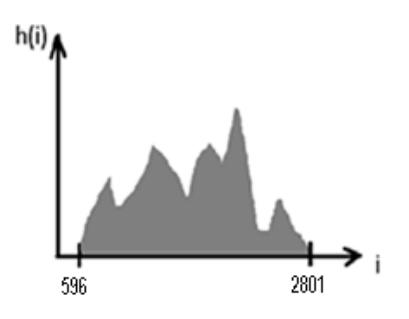
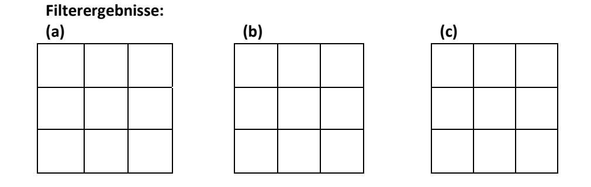
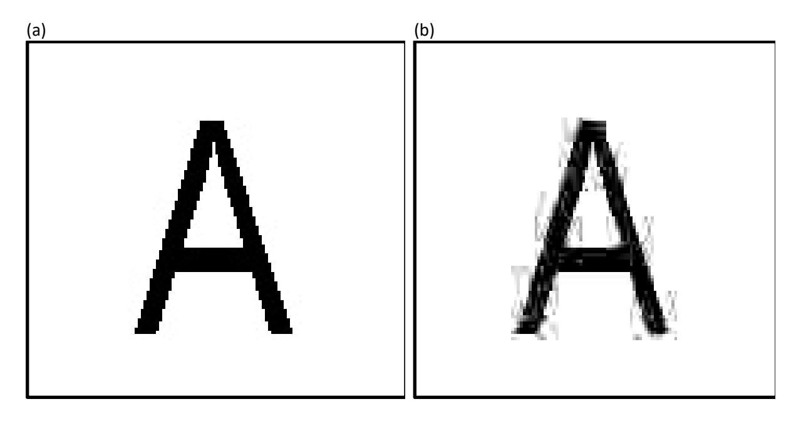

# Probeklausur Bildverarbeitung

Die Punkteangaben dienen zur Orientierung.

### 1. Speicherplatzbedarf von Bildern, indizierte Bilder, Druckgröße (8 Punkte)

Berechnen Sie den Speicherplatzbedarf eines Bildes der Größe 3840 × 2160 Pixel in Byte

- a) als unkomprimiertes RGB-Bild mit einer Farbauflösung von 24 Bit/Pixel,
- b) als Indexbild mit Verwendung einer Farbtabelle, wenn im Bild 103 Farben vorkommen,
- c) als Bild im YCbCr-Format (8 Bit/Kanal) mit 4:2:0 Chroma-Subsampling.
- d) Wie ist die Druckgröße in cm des Bildes bei einer Auflösung von 200 ppi?

### 2. Histogramme (3 Punkte)

Gegeben Sei folgendes Bild mit den Graustufen 0-3 (2 Bit/Pixel; 0 = schwarz, 1 = dunkelgrau, 2 = hellgrau, 3 = weiß). Skizzieren Sie zu diesem Bild

| U | ≞              | 1              |
|---|----------------|----------------|
| U | $\overline{2}$ | 3              |
| O | 3              | $\overline{c}$ |

- a) das (herkömmliche) Histogramm,
- b) das kumulative Histogramm,
- c) das "Binned" Histogramm der Größe 2 mit gleich langen Intensitätsintervallen.

#### 3. "Binned" Histogramme (2 Punkte)

Es soll ein "Binned" Histogramm der Größe 512 eines 16-Bit-Grauwertbildes (2<sup>16</sup> mögliche Graustufen) berechnet werden. Bestimmen Sie die Länge der Intensitätsintervalle, wenn diese gleich lang sind. Geben Sie die Grenzen des 100. Intervalls an.

### 4. Histogramme und Bildformate (1 Punkt)

Gegeben ist ein Digitalfoto, welches 5000 unterschiedliche Farben enthält. Das Foto liegt im RAW-Format mit 24 Bit/Pixel vor. Das Bild wird in den nachfolgend gegeben Formaten gespeichert. Bei welchen der Formate ändert sich typischerweise das Luminanz-Histogramm des Bildes gegenüber dem Original? Kreuzen Sie an!

- () JPEG mit 50%-Bildqualität
- $( )$  GIF
- () PNG (Echtfarben)

### 5. JPEG-Kompression (3 Punkte)

Bei der JPEG-Kompression werden die quantisierten AC-Koeffizienten eines Blocks mit 8 x 8 Werten in der so genannten Zick-Zack-Reihenfolge ausgelesen und einer Lauflängencodierung unterzogen. Begründen Sie, warum die Lauflängencodierung für die quantisierten AC-Koeffizienten sinnvoll ist und zur Speicherplatzeinsparung führt.

## 6. Punktoperationen - Autokontrast (2 Punkte)

Gegeben sei untenstehendes Histogramm eines 12-Bit-Grauwertbildes. Welchen Grauwert nimmt ein Pixel des Bildes mit dem Grauwert 1323 nach einer Autokontrastanpassung auf den Wertebereich [0, 4095] an?



# 7. Punktoperationen (2 Punkte)

Gegeben sei ein Algorithmus, der einen 10 Pixel breiten schwarzen Rahmen in ein Bild zeichnet, also die Pixel am Bildrand durch schwarze Pixel überschreibt. Überlegen Sie, ob dieser Algorithmus eine homogene Punktoperation realsiert. Begründen Sie Ihre Entscheidung.

### 8. Homogene Punktoperationen - Histogrammanpassung (3 Punkte)

Gegeben ist eine stückweise lineare Referenzverteilung  $P_L(i) = \langle 0, 0.2 \rangle, 120, 0.6 \rangle, 125, 1.0 \rangle$ . Gegeben sind zudem a = 50 und  $P_A(a)$ = 0.3. Berechnen Sie a'=f<sub>hs</sub>(a).

### 9. Homogene Punktoperationen - Histogrammausgleich (3 Punkte)

Berechnen Sie für das Bild aus Aufgabe 2 den Wert a' =  $f_{eq}(a)$  für a = 2. Die Zahl der Graustufen entspricht im Zielbild der des Originalbilds (2 Bit/Pixel; 4 Graustufen).

### 10. Homogene Punktoperationen - Klassifizierung (2 Punkte)

Gegeben ist folgende Look-Up-Tabelle (LUT) für die Graustufen i = 0,1,2,3 (2 Bit/Pixel; 0 = schwarz, 1 = dunkelgrau, 2 = hellgrau, 3 = weiß). Als welche Art von Punktoperation lässt sich die in der LUT dargestellte Abbildung f klassifizieren? Begründen Sie Ihre Entscheidung kurz.

| 0 |  |
|---|--|
|   |  |
|   |  |
|   |  |

### 11. Punktoperationen (3 Punkte)

Untenstehender Quellcode zeigt eine Punktoperation. Handelt es sich dabei um eine homogene Punktoperation und wenn ja, um welche? Begründen Sie kurz Ihre Entscheidung.

```
int w = \text{image.getWidth}();
int h = \text{image.getHeight}();
int a low = 255;
int a high = 0;
for (int u = 0; u \le w; u++) {
             for (int v = 0; v < h; v^{++}) {
                  int value = image.getPixel(u, v);
                  if (value \langle a_low) a_low = value;
                 if (value > a_high) a_high = value;
              \}\rightarrowfor (int u = 0; u \le w; u++) {
              for (int v = 0; v < h; v++) {
                  int value = image.getPixel(u, v);
                  image.putPixel(u, v, 255*(value-a_low)/(a_high-a_low));
              \}\overline{\phantom{a}}
```

### 12. Filter (11 Punkte)

Gegeben sei ein Bild der Größe 3x3 Pixel mit den folgenden Werten (Graustufen im Intervall [0, 255]):

| 76 | 0 | 3   |
|----|---|-----|
| 56 |   | 198 |
| 87 | 9 | 205 |

Außerhalb des Bildes sollen der Wert 128 angenommen werden. Das Bild soll jeweils durch untenstehende Filteroperationen bearbeitet werden. Passen Sie ggf. die Ergebnisse auf den gültigen Wertebereich an und streichen Sie die Nachkommastellen. Filtern Sie das Bild mittels

a) eines linearen Filters der Größe 3 x 1 (Spaltenzahl x Zeilenzahl, "Hotspot" im Zentrum) mit einem Faltungskern mit den Werten [0.1 0.8 0.1]

- b) eines Minimum-Filters der Größe 3 x 1,
- c) eines gewöhnlichen Medianfilters der Größe 3 x 1.
- $\lceil 0 \rceil$  $\mathbf{0}$ -01 d) Welche Wirkung hat ein gewichteter Medianfilter mit der Gewichtsmatrix  $\begin{bmatrix} 1 & 1 \end{bmatrix}$  $4$  auf ein L o  $\overline{0}$ Bild?
- e) Welche Wirkung auf ein Bild hat der lineare Filter aus Aufgabe a) grundsätzlich?



## 13. Bildartefakte (3 Punkte)

Bild (b) ist das Ergebnis einer Modifikation des Bildes (a). Für welches Verfahren ist eine Veränderungen der Bilddaten wie in Bild (b) sichtbar typisch? Erklären Sie die Ursache der in Bild (b) an den Kanten des abgebildeten Buchstabens auftretenden Artefakte (Störungen).

