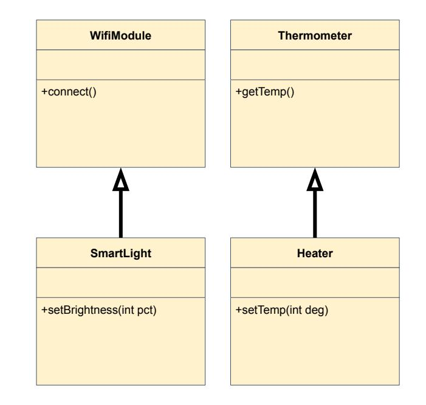
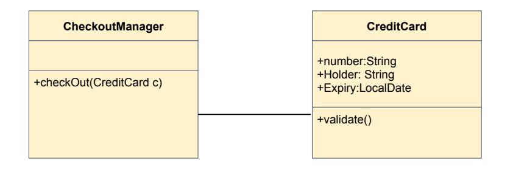

# Erwärmung 1: Vererbung vs. Komposition

> [!info] Kategorisieren Sie die folgenden Beziehungen als Vererbung (Ist-ein) oder Komposition (Hat-ein):

- Küche und Toaster
  Komposition
- Toaster und Küchengerät
  Vererbung
- Koch und Messer
  Komposition
- VeganeMahlzeit und Mahlzeit
  Vererbung
- Kühlschrank und Kompressor
  Komposition

# Erwärmung 2: Fernbedienung

Stellen Sie sich vor es gibt ein Interface FernBedienbar (RemoteControllable)

> [!info] Nennen Sie drei sehr unterschiedliche Dinge, die das Interface implementieren würden, vielleicht je eines aus dem Haushalt, aus einer Fabrik, aus einer Webapplikation

Das Interface FernBedienbar bedient verschiedene Klassen von
- Smart-Lampen
- Türen (Drehtür, Schiebetür, Tore)
- Interface reload / Component remount

> [!info] Was wären Methoden, die alle Dinge, die Fernbedienbar sind, gemeinsam haben?

- toggle
- bewegen

# **Smart-Home Refactoring**

Ein Junior-Entwickler stellt dieses Klassendiagramm vor. Es funktioniert, scheint aber nicht ganz richtig zu sein. Seine Idee: Ein Heater muss wie ein Thermometer die Temperatur messen können, und zusätzlich auch das Einstellen erlauben. Das SmartLight muss wie seine Oberklasse eine Verbindung zum WLAN herstellen, und zusätzlich die Helligkeit steuern können.

> [!info] Kritisieren Sie diesen Entwurf! Warum ist Heater als Spezialisierung von gefährlich? Macht es Sinn, wenn z.B. eine Methode calibrate (Thermometer t) mit einem Heater als Parameter aufgerufen wird (was syntaktisch legal ist)?


> [!info] Ändern Sie das Design und verwenden Sie Delegation statt Vererbung zu Funktionserweiterung und skizzieren Sie, wie ein Heater ein Thermometer benutzt, ohne selbst eines zu sein!


> [!info] Fügen Sie ein Interface "Serviceable" hinzu (Funktion: "reportStatus())" wo passt das hin?




# Late-Binding vs. Early-Binding

```
class Alpha {
   void print (Object o) { System.out.println ("Alpha-Obj"); }
	void show() { System.out.println("Alpha-Show"); }
    
class Beta extends Alpha {
    void print (String s) { System.out.println ("Beta-String"); }
    @Override void show() { System.out.println("Beta-Show"); }
    
// Execution code
Alpha item = new Beta();
Object msg = "Hello";
String text = "World";

// Console Logs
item.show();
item.print(msg);
item.print(text);
```

>[!info] Was ist die Konsolen-Ausgabe

```
Beta-Show
Alpha-Obj
Alpha-Obj
```

>[!info] Wann (Laufzeit / Compilezeit) wurde in jeder Zeile die Entscheidung getroffen, welcher Code ausgeführt wird?

1) Laufzeit (wegen override)
2) Kompilierzeit
3) Kompilierzeit

>[!info] Wir ändern die 1. Deklaration auf Beta item = new Beta();  $-$ Was passiert jetzt bei item.print(text)?

```
Beta-String
```

# **Payment-System**

Sie sollen das Payment-System, CheckoutManager, für einen Onlineshop entwerfen Momentan wird nur CreditCard unterstützt.

- 1) Wie würden Sie das System um eine neue Zahlungsweise, PayPal, erweitern?
- 2) Wie kann Checkout Manager eine Zahlung veranlassen ohne zu wissen. welches Zahlungsmittel verwendet wird?
- Zeichnen Sie ein UML-Diagramm mit 3) einer Generalisierung, PaymentMethod



# **Typensicherer Frachter**

Ein Frachter hat mehrere Frachtzone'n Wir wollen verhindern. dass nicht versehentlich ein Biohazard in einer NahrungsmittelZoneeinsortiert wird.

- Entwerfen Sie die Klasse FrachtZone<T> 1)
- Entwerfen Sie ein Interface Verderblich 2)  $\left(\text{getExpirationDate}\right)$  und ändern Sie FrachtZone so, dass es nur Typen akzeptiert, die dieses Interface implementieren  $Hint: class FrachtZone\ll T extends \Rightarrow$

Bei dieser Aufgabe können Sie einen Compiler zur Hilfe nehmen