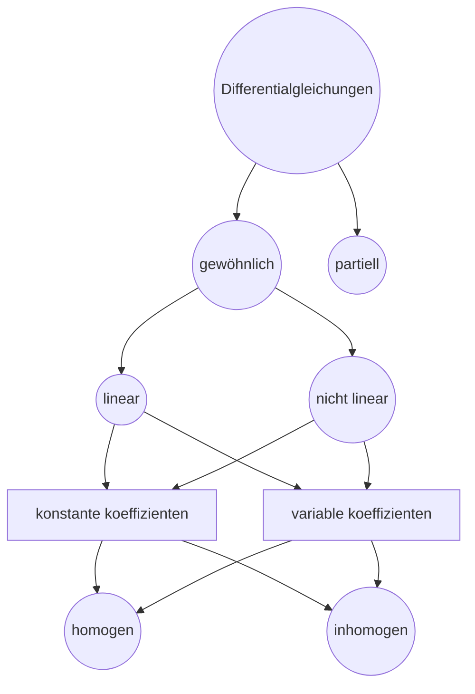

Ein DGL enthält eine Funktion und deren beliebig hohe Ableitungen.

Allgemeine Form:
$$a_0 y(x) + a_1 y'(x) + \dots + a_n y^{(n)} (x) = \underbrace{s(x)}_{\text{Störterm}}$$
gesucht: $y(x)$

__Klassifikation von Differentialgleichungen:__

__Linearität:__
Eine DGL heißt linear, wenn $y(x)$ und seine Ableitungen mit nur eine Potenz von höchstens $1$ haben.

Beispiele:
$y(x)^2 \rightarrow$ keine Linearität
$y'(x)^2 \rightarrow$ keine Linearität
$y(x)^2 \cdot y'(x)^2 \rightarrow$ keine Linearität
$2y'' + y = 1 \rightarrow$ linear

__Ordnung:__
Die Ordnung ist die höchste auftretende Ableitung.
$y'' + 3y' -y =1 \Rightarrow$ Ordnung ist $2$

__Homogenität:__
$a_0 y(x) + a_1 y'(x) + \dots + a_n y^{(n)} (x) = \underbrace{s(x)}_{\text{Störterm}}$
$s(x)=0 \rightarrow$ homogen
$s(x) \neq 0 \rightarrow$ inhomogen

Beispiele:
$2y - y' = 0 \rightarrow$ homogen
$2y - y' = 3 \rightarrow$ inhomogen

__Gewöhnlich/partiell:__
Gewöhnlich: $y(x)$
Hängt von einer einzigen unabhängigen Variablen ab
Bsp.: $y(x) + 3y' =0$

Partiell: $y(x_1, x_2, \dots)$
Hängt von mehreren unabhängigen Variablen ab $(x_1, x_2, \dots)$
Bsp.: $y(x_1, x_2) + \frac{\partial y}{\partial x_1} \cdot \frac{\partial y}{\partial x_2} = x_1$

## 17.1 Der Exponentialansatz

Wird verwendet für lineare Differentialgleichungen mit konstanten Koeffizienten.

$$a_0 + a_1y' + a_2y'' + \dots + a_n y^{(n)} = 0$$
$$\boxed{y = c e^{\lambda x} \quad , \quad y' = c \lambda e^{\lambda x} \quad , \quad y' = c \lambda^2 e^{\lambda x}}$$
$$\boxed{y(x) = c_1 e^{\lambda_1 x} + c_2 e^{\lambda_2 x}}$$

__Beispiel 1:__

$y'' + 5y' + 2y = 0$

$\lambda^2 + 5\lambda + 2 = 0$
$\lambda_{1,2} = \frac{-5 \pm \sqrt{17}}{2}$
$\lambda_1 = \frac{-5 + \sqrt{17}}{2}$
$\lambda_2 = \frac{-5 - \sqrt{17}}{2}$

$y(x) = C_1 e^{\lambda_1 x} + C_2 e^{\lambda_2 x}$
$y(x) = C_1 e^{\left(\frac{-5 + \sqrt{17}}{2}\right)x} + C_2 e^{\left(\frac{-5 - \sqrt{17}}{2}\right)x}$

$y(0) = C_1 e^{\lambda_1 \cdot 0} + C_2 e^{\lambda_2 \cdot 0}$
$y(0) = C_1 e^0 + C_2 e^0$
$y(0) = C_1 + C_2$

$C_1 + C_2 = 1 \quad \Rightarrow C_{1,2} = \frac{1}{2}$

$y(x) = \frac{1}{2} \left( e^{\left(\frac{-5 + \sqrt{17}}{2}\right)x} + e^{\left(\frac{-5 - \sqrt{17}}{2}\right)x} \right)$

__Beispiel 2:__

$3y'' - 3y' + \frac{3}{4}y = 0 \quad \text{mit} \quad y(0) = 1$
$3\lambda^2 - 3\lambda + \frac{3}{4} = 0 \quad /3$
$\lambda^2 - \lambda + \frac{1}{4} = 0$
$\lambda_{1,2} = -\left(-\frac{1}{2}\right) \pm \sqrt{\left(\frac{1}{2}\right)^2 - \frac{1}{4}}$
$\lambda_{1,2} = \frac{1}{2} \pm \sqrt{\frac{1}{4} - \frac{1}{4}}$
$\lambda_{1,2} = \frac{1}{2}$
$y(x) = C_1 \cdot e^{\frac{1}{2}x} + C_2 \cdot x \cdot e^{\frac{1}{2}x}$
$y(x) = (C_1 + C_2 \cdot x) \cdot e^{\frac{1}{2}x}$
$y(0) = (C_1 + C_2 \cdot 0) \cdot e^{0} = 1$
$C_1 = 1$
$y(x) = (1 + C_2 x) e^{0,5x}$

### 17.1.1 Herleitung
$$y = c \cdot e^{\lambda} \quad , \quad c, \lambda \in \mathbb{R} \text{ und konstant}$$
$$y^{(n)} = c \lambda ^n e^{\lambda x}$$
Einsetzen in die originale/ursprüngliche DGL
$$\Rightarrow a_0ce^{\lambda x} + a_1ce^{\lambda x} + \dots + a_nce^{\lambda x} = 0$$
$/e^{\lambda x}$
$$\Rightarrow a_0c + \lambda a_1c + + \lambda^2 a_2c + \dots + \lambda^n a_nc = 0$$
$/c$
Charakteristisches Polynom:
$$\Rightarrow a_0 + \lambda a_1 + \lambda ^2 a_2 + \dots + \lambda^n a_n = 0$$
Auflösen nach $\lambda$ und in den Ansatz einsetzen
$$\Rightarrow y = c \cdot e^{\lambda x}$$
Bestimmung von $c$ per Anfangsbedingung
$$y(x_0) = y_0$$
Einsetzen der Anfangsbedingung in den Exponentialansatz
$$\Rightarrow y_0 = c \cdot e^{\lambda x}$$
$/e^{\lambda x}$
$$\Rightarrow c = \frac{y_0}{e^{\lambda x}}$$
$$\Rightarrow y = \frac{y_0}{e^{\lambda x_0}} \cdot e^{\lambda x}$$
Superposition bei mehreren $\lambda$ (z.B. entstehen bei einem quadratischen charakteristischen Polynom 2. Graded per p-q-Formel zwei $\lambda$)
$$\boxed{y = c (e^{\lambda_1 x} + e^{\lambda_2 x})}$$

## 17.2 Trennung  der Variablen

Dient zur Lösung von Differentialgleichungen der Form
$$y' = f(y) g(x)$$
$$\Rightarrow \frac{dy}{dx} = f(y) g(x)$$
$$\Rightarrow \frac{dy}{f(y)} = g(x) dx$$
$$\Rightarrow \frac{1}{f(y)} dy = g(x) dx$$
$\int$
$$\boxed{\Rightarrow \int \frac{1}{f(y)} dy = \int g(x) dx}$$

__Beispiele:__

$y' = xy$
$\frac{dy}{dx} = xy$
$\int \frac{1}{y} \, dy = \int x \, dx$
$\ln(y) = \frac{1}{2}x^2 + C \quad / e ^{\hat{}}$
$e^{\ln(y)} = y = e^{\frac{1}{2}x^2 + C}$
$y = e^{\frac{1}{2}x^2} \cdot \underbrace{e^C}_{\tilde{C}}$
$y = \tilde{C} e^{\frac{1}{2}x^2}$
mit $y(0) = 1$
$\tilde{C} = 1$
$\underline{\underline{\Rightarrow y = e^{\frac{1}{2}x^2}}}$

$y' \cdot y = 2x \quad \text{mit} \quad y(0) = 1$
$\frac{dy}{dx} \cdot y = 2x$
$y \, dy = 2x \, dx$
$\int y \, dy = \int 2x \, dx$
$\frac{1}{2}y^2 = x^2 + C$
Formel nach $y$ umstellen
$y^2 = 2x^2 + 2C$
$y(x) = \sqrt{2x^2 + \tilde{C}}$
$1 = \sqrt{2(0)^2 + \tilde{C}} \implies \tilde{C} = 1$
$\underline{\underline{y(x) = \sqrt{2x^2 + 1}}}$

$y' - x = 0 \quad \text{mit} \quad y(0) = 1$
$\frac{dy}{dx} = x$
$dy = x \, dx$
$\int 1 \, dy = \int x \, dx$
$y(x) = \frac{1}{2}x^2 + C$
$1 = \frac{1}{2}(0)^2 + C \implies C = 1$
$y(x) = \frac{1}{2}x^2 + 1$