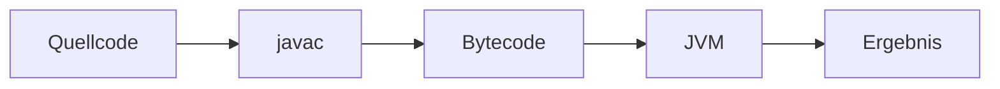
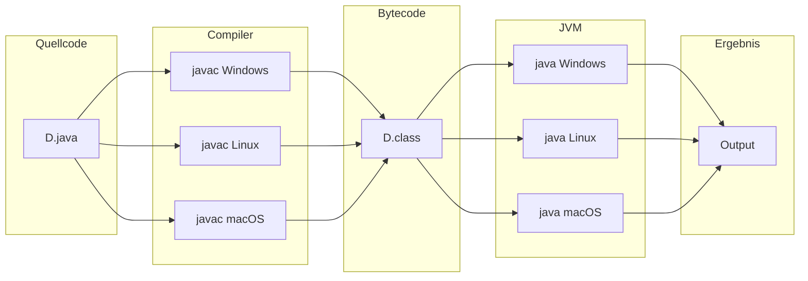
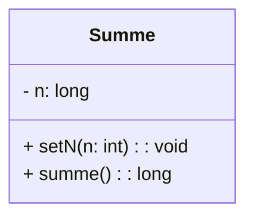
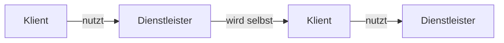
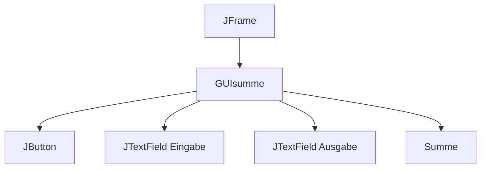

## 0.1 Was ist Java?

Java ist eine Insel im Südpazifik (eine der 13000 Inseln von Indonesien) mit 120 Millionen Einwohnern, Hauptstadt Jakarta. Bekannt für den Vulkan Merapi und den Exportkaffee (strenger, aromatisch-würziger Geschmack).

Die Programmiersprache Java wurde von Sun Microsystems Inc. entwickelt mit folgenden Eigenschaften:

- simple (einfach)
- object-oriented (objektorientiert)
- distributed (verteilt)
- interpreted (interpretiert)
- robust (robust)
- secure (sicher)
- architecture neutral (architekturneutral)
- portable (portierbar)
- high-performance (hohe Leistung)
- multithreaded (multithreaded)
- dynamic language (dynamische Sprache)

## 0.2 Was ist OOP?

Objektorientiert ist ein Programmierparadigma und bedeutet:

1. Alles ist ein Objekt
2. Objekte kommunizieren durch das Senden und Empfangen von Nachrichten (welche aus Objekten bestehen)
3. Objekte haben ihren eigenen Speicher (strukturiert als Objekte)
4. Jedes Objekt ist Instanz einer Klasse (welche ein Objekt sein muss)
5. Die Klasse beinhaltet das Verhalten aller ihrer Instanzen (in der Form von Objekten in einer Programmliste)
6. Um eine Programmliste auszuführen, wird die Ausführungskontrolle dem ersten Objekt gegeben und das Verbleibende als dessen Nachricht behandelt

## 0.3 Grundkonzepte der OOP

**Datenabstraktion**

Gemeinsame Eigenschaften und Fähigkeiten eines Gegenstandes oder Begriffs zusammenfassen und beschreiben.

**Datenkapselung**

Zustandsänderung der Objekteigenschaften nur über dafür vorgesehene Operationen (Methoden).

**Vererbung**

Erweiterung vorhandener Objekte zu neuen Objekten mit zusätzlichen Eigenschaften und Operationen bei bestehenbleibender Kompatibilität zum Ursprungstyp.

**Polymorphie**

Es wird zu Laufzeit entschieden, wie das aktuelle Objekt in Abhängigkeit von der aktuellen Objektreferenz auf eine bestimmte Nachricht reagiert.

*Inhalt der Vorlesung: Wie werden diese Grundkonzepte in der Sprache Java umgesetzt?*

## 0.4 Java als interpretierte Sprache

Der Quellcode wird von einem Compiler (javac) in einen Byte-Code compiliert und dieser wird von einer virtuellen Maschine (java) der Zielplattform interpretiert und ausgeführt.



**Nachteile:**
- Langsamer als die direkte Ausführung von Maschinencode

**Vorteile:**
- Bytecode ist plattformunabhängig
- Gleicher Bytecode wird von der JVM der jeweiligen Plattform ausgeführt

## 0.5 Architecture neutral & portable

Die JVM ist auf sehr vielen Plattformen implementiert: Unix, MacOS, Windows sowie verschiedenen Browser. Die Programme werden (zur Laufzeit) automatisch an das Look-and-Feel der einzelnen Plattformen angepasst.



## 0.6 ByteCode einer Klasse

Beispiel ByteCode der Klasse Beispiel1:

```
00000000: ca fe ba be 00 00 00 31 00 1d 0a 00 06 00 0f 09
...
```

Der ByteCode beginnt mit der Magischen Zahl `ca fe ba be` (Java Class File).

## 0.7 Simple - Dynamic - Distributed

**Einfachheit:**
- Wenige Sprachkonstrukte
- Wenige Schlüsselworte
- Keine Pointer (Pointer arbeiten im Hintergrund)
- Garbage Collection – automatische Entsorgung nicht mehr referenzierter Objekte
- Keine Mehrfachvererbung

**Dynamik:**
- Die Interpreterstruktur von Java ermöglicht das dynamische Nachladen von .class-files
- Es werden beim Programmstart nicht alle Klassen des Programmes geladen
- Nachladen erfolgt nach Bedarf
- Gut geschriebene Programme können dynamisch an verändernde Bedürfnisse angepasst werden

**Beispiel für Dynamik:**
Angenommen, es läuft aktuell ein Projekt, welches in einer Endlosschleife Daten ausliest und diese aufbereitet ausgibt:
- Für eine ganze Zahl die Fakultät (es werden mehr Stellen benötigt)
- Für einen Algorithmus eine Festkommazahl (man braucht einen besseren Algorithmus)
- Sortierung der Daten muss effektiver erfolgen
- Eine weitere Aufbereitung der Daten wird benötigt

Java bietet die Möglichkeit, während der Laufzeit unter Beachtung bestimmter Bedingungen neue Klassen einzubinden und diese auszuführen.

## 0.8 Erstellen und Ausführen einer Java-Applikation

**Schritte**

1. **Quellcode erzeugen und speichern** unter `Bsp.java`
2. **Kompilieren** mittels `"%JAVA_HOME%\bin\javac" Bsp.java` → Ergebnis: `Bsp.class`
3. **Ausführen** mittels `"%JAVA_HOME%\bin\java" Bsp`

**Voraussetzungen**

- Ein JDK (Java Development Kit)
- Ein Editor

**Empfehlung:** Mit der Umgebungsvariablen `JAVA_HOME` arbeiten, welche ggf. mit dem Pfad zum aktuellen JDK gesetzt werden muss.

Beispiel:
```
set JAVA_HOME = "C:\Program Files\Java\jdk1.8.0_121"
```

## 0.9 Java-Applikation erstellen

### 0.9.1 Quellcode schreiben

Es wird eine Klasse mit der Methode `public static void main(String[] args)` zum Einstieg in die JVM benötigt.

**Java:**
```java
public class Main {
    public static void main(String[] args) {
        System.out.println("Java ist super!!!");
    }
}
```

**Vergleich mit C++:**
```cpp
#include <iostream>
using namespace std;
int main() {
    cout << "Hallo User" << endl;
    cin.get();
    return 0;
}
```

### 0.9.2 Quellcode compilieren

ByteCode erzeugen mit `"%JAVA_HOME%\bin\javac" Main.java`
Ergebnis: `Main.class`

### 0.9.3 Bytecode ausführen

JVM interpretiert mit `"%JAVA_HOME%\bin\java" Main`
Ergebnis auf der Konsole: `Java ist super!!!`

## 0.10 Klassen in der OOP

In der OOP schreibt man Klassen.

**UML-Darstellung und Java-Code**



```java
// Diese Klasse berechnet die Summe
// der ganzen Zahlen von 1 bis n
public class Summe {
    private long n;

    public void setN(int x) {
        n = x;
    }

    public long summe() {
        return n*(n+1)/2;
    }
}
```

## 0.11 Eine Klasse in einer Applikation

**Aufrufende Klasse Main:**
```java
public class Main {
    public static void main(String[] args) {
        Summe summe = new Summe();
        summe.setN(100);
        System.out.println(summe.summe());
    }
}
```

**Klasse Summe:**
```java
class Summe {
    private long n;

    public void setN(int x) {
        n = x;
    }

    public long summe() {
        return n*(n+1)/2;
    }
}
```

**Vergleich mit C++:**
```cpp
// Summe.h
class Summe {
public:
    int n;
    void setN(int nn) {
        n = nn;
    }
    int summe() {
        return n*(n+1)/2;
    }
};

// MainS.cpp
#include <iostream>
#include "Summe.h"
using namespace std;
int main() {
    Summe sum;
    sum.setN(12);
    cout << sum.summe() << endl;
    cin.get();
    return 0;
}
```

## 0.12 Typisch OOP und typisch für Java

Jede Klasse bietet Dienste (Methoden) an. Jedes Objekt kann diese Dienste auf sich selbst ausführen oder andere Objekte mit der Ausführung von Diensten beauftragen.

**Klient-Dienstleister-Modell**



Ein Klient nutzt Methoden eines Dienstleisters. Der Dienstleister wird oft selbst zum Klient und nutzt Methoden eines anderen Dienstleisters.

**Beispiele**

**Beispiel2:**
- Scanner: Lesen von der Konsole
- Main: Hauptklasse für den Start
- Summe: Realisieren des Algorithmus

**BspFibonacci:**
- Scanner: Lesen von der Konsole
- Main: Hauptklasse für den Start
- Fibonacci: Realisieren des Algorithmus
- BigInteger: Hilfsklasse für große Zahlen

## 0.13 Java-GUI Projekt (BeispielGUI)

**Verwendete Packages**

- `javax.swing` — für Swing-Komponenten
- `java.awt.event` — für Event-Handling

**Klassenstruktur**



**Klassenbeziehungen**

- `JButton` — Schaltfläche
- `JText` — Textfelder für Ein- und Ausgabe
- `JFrame` — Hauptfenster
- `GUIsumme` — Eigenentwicklung für GUI-Logik
- `Summe` — Algorithmus-Klasse

**Main-Klasse**

Dient zum Starten der GUI-Anwendung.

## 0.14 Vorgesehene Themen und Probleme

**Elementare Sprachelemente**

- Bezeichner
- Datentypen
- Variable
- Methoden
- Kontrollstrukturen

**Klassen im Detail**

- Klassen
- Packages
- Zugriffsmodifier
- Member
- static Member
- Konstruktoren
- Kapselung

**Vererbung, ABC, Interfaces, Polymorphie**

- Regeln
- Überschreiben
- Konstruktoren
- Liskovsche Substitution
- Schnittstellenkonzept
- Klasse Object

**Ausgewählte Probleme und Klassen des JDK**

- Delegation vs Vererbung
- Beziehungen zwischen Klassen
- Generics
- Ausgewählte Klassen: String, Enums, Array, Wrapperklassen
- Exceptions
- Serialisierung
- jar-Files

**JCF (Java Collections Framework)**

- Gleichheit und Sortieren von Objekten
- Ausgewählte Collections des JCF

**GUI**

- Grafische User Interfaces mit Swing

*Hinweis: Die Codebeispiele in der Vorlesung sind nicht bis in das letzte Detail ausprogrammiert. Es sollen stets nur wesentliche Aspekte der behandelten Problematik dargestellt werden.*

## 0.15 Literatur

**Empfehlenswerte Auswahl**

**Ullenboom, Christian: Java ist auch eine Insel**
- Galileo Computing
- Aktuelle Auflage

**Esser, Friedrich: Java 2, Designmuster und Zertifizierungswissen**
- Galileo Computing

Beide Bücher sind online verfügbar unter: `http://www.galileocomputing.de/openbook`

**Krüger, G.: Java 2**
- Addison Wesley

**API-Dokumentation:**
- Java 2 Platform SE 6.0 API Specification
- `http://java.sun.com/j2se/1.5.0/docs/api/`

**The Java Tutorials (SUN):**
- `http://java.sun.com/docs/books/tutorial`

**Baltes-Götz & Götz: Einführung in das Programmieren mit Java 17**
- Java17.pdf (liegt bei OPAL)
