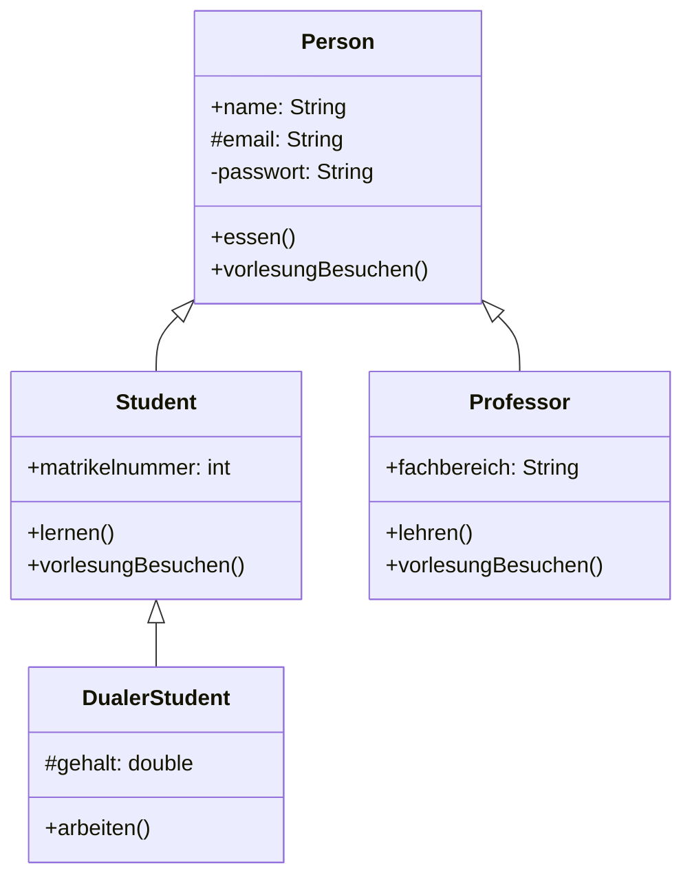
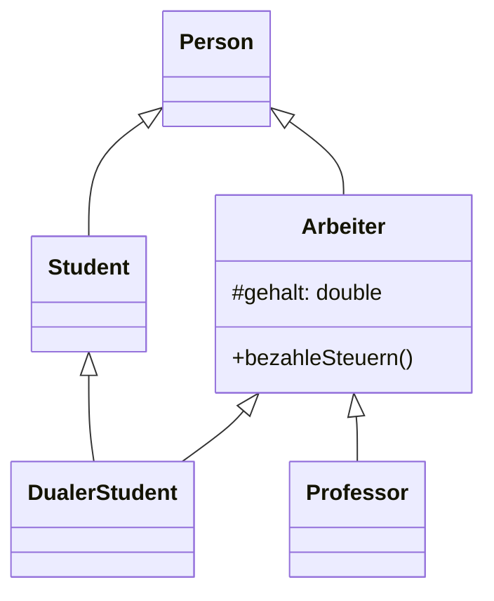
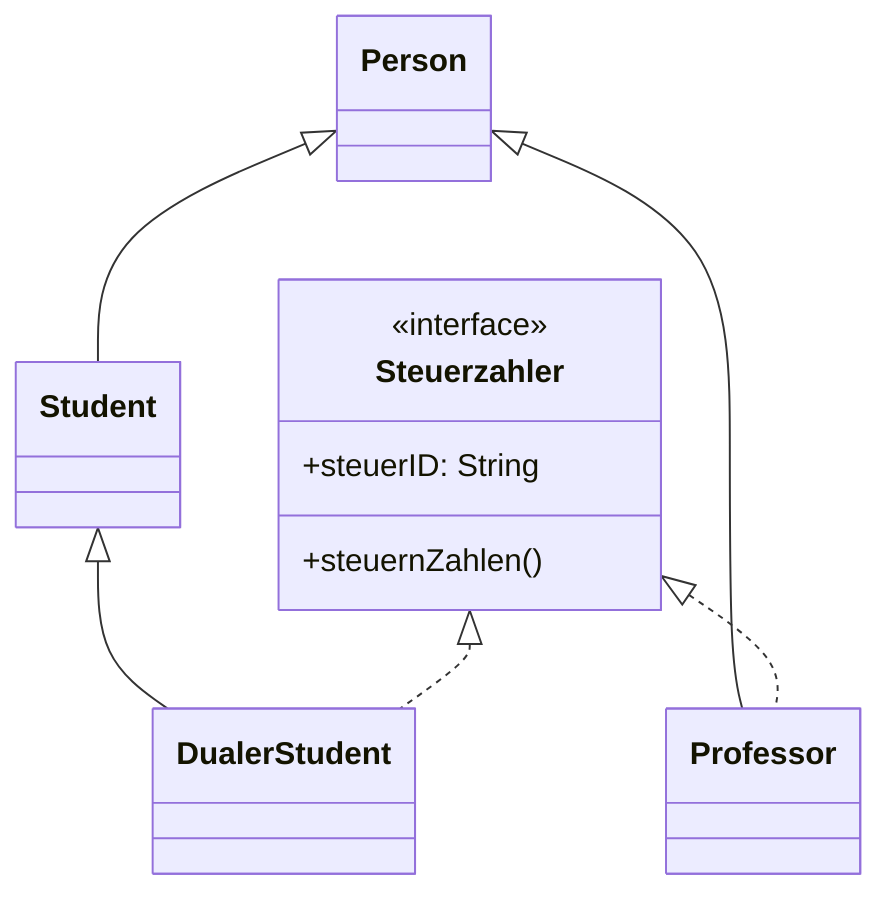
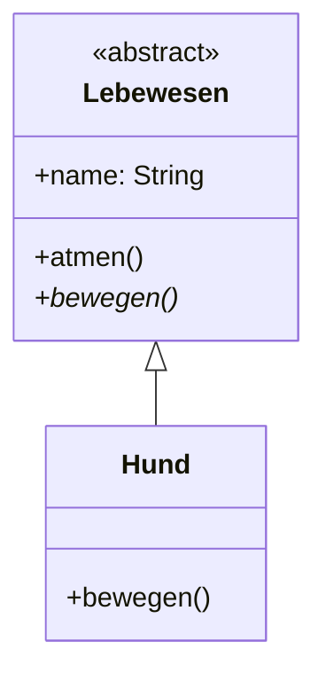
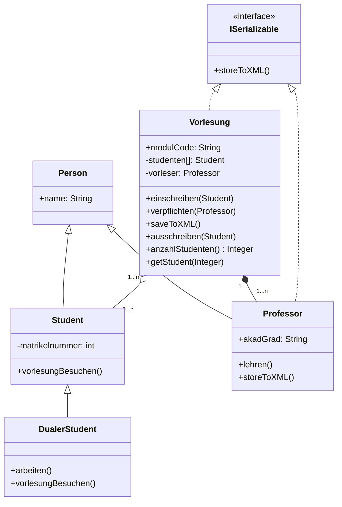
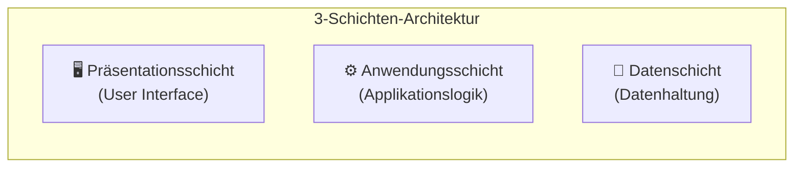
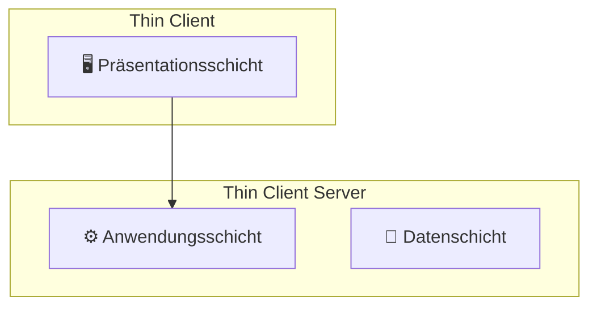
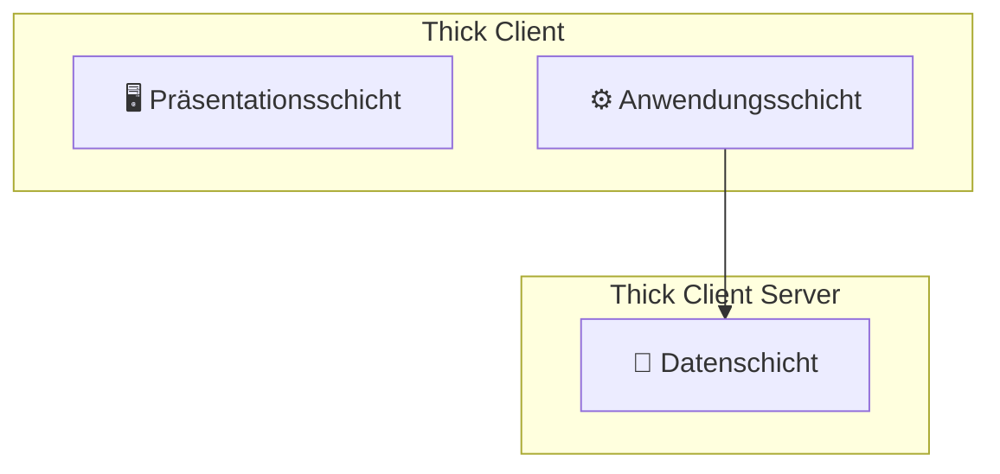

---
tags:
  - sem2
  - ooe
type: lecture
date: 2026-04-23
updated: 2026-05-04
---
- Eigenschaften und Methoden einer Basisklasse an eine abgeleitete Klasse weitergeben
- Person ist die Oberklasse von Student und Professor (Generalisierung, vererbt)
- Student und Professor sind Unterklassen von Person (Spezialisierung, erbt)
- **Einfachvererbung:** Eine Klasse erbt von genau einer Basisklasse (Java)
- **Mehrfachvererbung:** Eine Klasse erbt von mehreren Basisklassen gleichzeitig (C++)




```java
public class Person {
    public String name;
    protected String email;
    private String passwort;

    public void essen() {
        System.out.println("Person isst.");
    }

    public void vorlesungBesuchen() {
        System.out.println("Person betritt den Hörsaal.");
    }
}

public class Student extends Person {
    public int matrikelnummer;

    public void lernen() {
        System.out.println("Student lernt.");
    }

    @Override
    public void vorlesungBesuchen() {
        super.vorlesungBesuchen();
        System.out.println("Student hört zu und schreibt mit.");
    }
}

public class Professor extends Person {
    public String fachbereich;

    public void lehren() {
        System.out.println("Professor lehrt.");
    }

    @Override
    public void vorlesungBesuchen() {
        super.vorlesungBesuchen();
        System.out.println("Professor hält die Vorlesung.");
    }
}

public class DualerStudent extends Student {
    protected double gehalt;

    public void arbeiten() {
        System.out.println("Dualer Student arbeitet im Unternehmen.");
    }
}

Person p;

// polymorpher Funktionsaufruf (Methodenauflösung erfolgt zur Laufzeit)
if (Hochschule == Uni)
	p = new Student();
if (Hochschule == DualeHochschule)
	p = new DualerStudent();
p.vorlesungBesuchen();
```

- `public` (`+`): Zugriff von überall möglich.
- `protected` (`#`): Zugriff innerhalb der Klasse, des Pakets und durch Unterklassen möglich.
- `private` (`-`): Zugriff nur innerhalb der eigenen Klasse möglich.
- (default): Zugriff nur innerhalb des eigenen Pakets (Package-private).

## 1.1 Interfaces

### 1.1.1 Problem: Mehrfachvererbung (ANTIPATTERN)



### 1.1.2 Lösung über Interfaces




```java
public interface Steuerzahler {
    void steuernZahlen();
}

public class Professor extends Person implements Steuerzahler {
    @Override
    public void steuernZahlen() {
        System.out.println("Professor zahlt Steuern.");
    }
}

public class DualerStudent extends Student implements Steuerzahler {
    @Override
    public void steuernZahlen() {
        System.out.println("Dualer Student zahlt Steuern.");
    }
}
```

> [!example] Praxisbeispiel: [[wiki/SEM2/☕ OOE/Übungen#2.2 Erwärmung 2: Fernbedienung|Interface-Implementierung (Fernbedienung)]]

>Interfaces haben keinen Code, nur einen Methodenrumpf

## 1.2 Abstrakte Klassen

- Klassen, von denen **kein Objekt** erzeugt werden kann (Instanziierung nicht möglich).
- Dienen als Vorlage für Unterklassen.
- Können **abstrakte Methoden** enthalten (Methoden ohne Rumpf, die in Unterklassen überschrieben werden müssen).



```java
public abstract class Lebewesen {
    public String name;

    public void atmen() {
        System.out.println("Lebewesen atmet.");
    }

    // Abstrakte Methode: muss von Unterklassen implementiert werden
    public abstract void bewegen();
}

public class Hund extends Lebewesen {
    @Override
    public void bewegen() {
        System.out.println("Hund läuft auf vier Pfoten.");
    }
}
```

## 1.3 Standard-Interfaces

Java bietet vordefinierte Interfaces für häufige Aufgaben:

### 1.3.1 Cloneable

- Markierungs-Interface (besitzt keine Methoden).
- Erlaubt die Nutzung von `Object.clone()`, um eine flache Kopie eines Objekts zu erstellen.

### 1.3.2 Comparable

- Wird genutzt, um eine natürliche Ordnung für Objekte festzulegen (z.B. für `Collections.sort()`).
- Methode: `int compareTo(T o)`

```java
public class Student implements Comparable<Student> {
    public int matrikelnummer;

    @Override
    public int compareTo(Student other) {
        return Integer.compare(this.matrikelnummer, other.matrikelnummer);
    }
}
```

### 1.3.3 Serializable

- Markierungs-Interface.
- Ermöglicht es, ein Objekt in einen Byte-Stream umzuwandeln (persistente Speicherung oder Netzwerkübertragung).
- Felder, die nicht serialisiert werden sollen, werden mit `transient` markiert.

```java
public class User implements Serializable {
    private String username;
    private transient String passwort; // wird nicht gespeichert
}
```

### 1.3.4 Konstanten in Interfaces

Interfaces können auch Konstanten definieren. Diese sind implizit immer `public static final`.

```java
public interface Konfiguration {
    int MAX_VERSUCHE = 3;
    String VERSION = "1.0.0";
}
```

Da Interfaces primär Verhalten (Methoden) definieren sollen, gilt das "Constant Interface Pattern" (Interfaces nur für Konstanten) heutzutage eher als **Antipattern**. Konstanten sollten stattdessen dort stehen, wo sie logisch hingehören (z.B. in der zugehörigen Klasse oder einem Enum).

## 1.4 Konstruktoren

>Konstruktoren werden benötigt um Instanzen von Klassen zu erstellen.

```java
class Pizza {
    String teig;
    Pizza(String teig) { this.teig = teig; }
}

class SalamiPizza extends Pizza {
    int salamiScheiben;

    SalamiPizza(String teig, int anzahl) {
        super(teig);
        this.salamiScheiben = anzahl;
    }
}

// Anwendung:
SalamiPizza meinePizza = new SalamiPizza("Dinkel", 10);
System.out.println(meinePizza.teig);           // "Dinkel"
System.out.println(meinePizza.salamiScheiben); // 10
```

## 1.5 Getter und Setter

- Ermöglichen den kontrollierten Zugriff auf `private` Attribute (**Datenkapselung**).
- Verhindern ungültige Zustände durch Validierung innerhalb der Setter-Methoden.

```java
public class Student {
    private String name;
    private int semester;

    // Getter: Ermöglicht lesenden Zugriff
    public String getName() {
        return name;
    }

    // Setter: Ermöglicht schreibenden Zugriff mit Validierung
    public void setSemester(int semester) {
        if (semester >= 1 && semester <= 12) {
            this.semester = semester;
        } else {
            System.out.println("Fehler: Ungültiges Semester!");
        }
    }

    public int getSemester() {
        return semester;
    }
}
```

## 1.6 Aggregation und Komposition




>**Aggregation (leere Raute):** Eine "schwache" Beziehung. Die beteiligten Objekte können unabhängig voneinander existieren

 Aggregation (Student - Vorlesung): Die Vorlesung ist das übergeordnete Objekt, das mehrere Studenten beinhaltet (siehe Attribut -studenten[]). Daher gehört die Raute an die Klasse Vorlesung. Es ist eine Aggregation (leere Raute), weil Studenten auch unabhängig von einer speziellen Vorlesung existieren können.


>**Komposition (gefüllte Raute):** Eine "starke" Aggregation mit Existenzabhängigkeit. Das Teilobjekt existiert nur, solange auch das Ganzobjekt existiert

Komposition (Professor - Vorlesung): Auch hier ist die Vorlesung in diesem spezifischen Modell der Besitzer des Vorlesers (siehe Attribut -vorleser). Die gefüllte Raute signalisiert, dass die Vorlesung ohne einen zugeordneten Professor nicht existieren kann (Existenzabhängigkeit).

> [!example] Übung: [[wiki/SEM2/☕ OOE/Übungen#2.1 Erwärmung 1: Vererbung vs. Komposition|Vererbung vs. Komposition]] und [[wiki/SEM2/☕ OOE/Übungen#2.3 Smart-Home Refactoring|Smart-Home Refactoring (Delegation)]]


```java
public class StudentenListe {
    private List<Student> studenten = new ArrayList<>();

    public void einschreiben(Student s) {
        if (s != null && !studenten.contains(s)) {
            studenten.add(s);
        }
    }

    public void ausschreiben(Student s) {
        studenten.remove(s);
    }

    public int anzahlStudenten() {
        return studenten.size();
    }

    public Student getStudent(int index) {
        if (index >= 0 && index < studenten.size()) {
            return studenten.get(index);
        }
        return null;
    }
}
```

## 1.7 Generics

Generics ermöglichen es, Klassen, Interfaces und Methoden so zu definieren, dass sie mit verschiedenen Datentypen arbeiten können, ohne die Typsicherheit zu verlieren. Der Typ wird erst bei der Instanziierung festgelegt (Platzhalter `<T>`).

**Bsp.:** Eine generische Box kann jedes beliebige Objekt speichern. Der Typ `T` dient als Platzhalter.

```java
public class Box<T> {
    private T inhalt;

    public void setInhalt(T inhalt) {
        this.inhalt = inhalt;
    }

    public T getInhalt() {
        return inhalt;
    }
}

// Anwendung:
Box<String> namenBox = new Box<>();
namenBox.setInhalt("Max");

Box<Integer> zahlenBox = new Box<>();
zahlenBox.setInhalt(42);
```

> [!example] Übung: [[wiki/SEM2/☕ OOE/Übungen#2.6 Typensicherer Frachter|Generics am Beispiel eines Frachters]]

## 1.8 Listen und Mengen

Java bietet verschiedene Datenstrukturen zur Speicherung von Objekten im `java.util`-Paket:

### 1.8.1 Listen

>Eine Liste ist eine geordnete Sammlung, die Duplikate erlaubt.

**ArrayList**
- Basiert auf einem **Array**.
- Schneller Zugriff über den Index, aber langsames Einfügen/Löschen in der Mitte.
- **Speicherlayout:** Elemente werden in einem zusammenhängenden Speicherblock abgelegt. Dies ermöglicht den direkten Zugriff auf jedes Element über seine Adresse.
- **Formel für die Speicheradresse des $i$-ten Elements:**
  $$A = \text{Startadresse} + i \cdot \text{sizeof}(\text{Element})$$
- Zeitkomplexität für das **Lesen: $O(1)$** (konstante Zeit).

```java
List<String> namen = new ArrayList<>();
namen.add("Alice");
namen.add("Bob");
namen.add("Alice"); // Dublikat erlaubt
```

**LinkedList**
- Jedes Element kennt seinen Nachfolger (**Pointer**).
- Schnelles Einfügen/Löschen, aber langsamerer Direktzugriff.
- **Speicherlayout:** Die Elemente liegen **verstreut im Speicher**. Jedes Element (Node) besteht aus dem Inhalt und einem Pointer auf das nächste Element.
- Um das $i$-te Element zu finden, muss die Liste vom Start weg traversiert werden.
- Zeitkomplexität für das **Lesen: $O(n)$** (linearer Aufwand).

**Doppelt verkettete Liste**
- Jedes Element besitzt einen Zeiger auf seinen **Vorgänger** und seinen **Nachfolger**.
- Zeitkomplexität für **Einfügen/Löschen: $O(1)$** (konstanter Aufwand), da lediglich Zeiger umgebogen werden müssen (sofern die Position bekannt ist).

>Es ist der Typ zu wählen basierend darauf welche Operationen am häufigsten durchführt werden

### 1.8.2 Mengen

Ein Set ist eine Sammlung, die **keine Duplikate** erlaubt.
- **HashSet:** Speichert Elemente ungeordnet. Sehr schnell beim Suchen und Einfügen.
- **TreeSet:** Speichert Elemente in ihrer natürlichen Sortierung (z.B. alphabetisch).

```java
Set<String> eindeutigeNamen = new HashSet<>();
eindeutigeNamen.add("Alice");
namen.add("Bob");
eindeutigeNamen.add("Alice"); // Dublikat wird ignoriert
```

# 1.9 3-Schichten-Architektur



- **Präsentationsschicht:** Swing, Swift, HTML
- **Anwendungsschicht:** Domänenmodell
- **Datenschicht:** JSON, XML, Relationale Datenbank

### 1.9.1 Thin Client und Thick Client




- **Thin Client:** Die gesamte Verarbeitung findet auf dem Server statt. Der Client dient nur der Darstellung und Eingabe (z. B. Web-Browser, Terminal).
- **Thick Client:** Die Applikationslogik läuft direkt auf dem Client. Der Server ist nur für die Datenhaltung zuständig (z. B. Desktop-Anwendung mit lokaler Datenbankverbindung).

## 1.10 User-Interfaces

**2 Phasen:**
- Aufbau-Phase: (Fenster-)Struktur, Datenstrukturen, App-Logik, Verbinden des Reaktionscodes für UI-Events, Modell-Aktualisierungen
- Reaktions-Phase: Asynchrone Kommunikation mit User + Modell - Steuerfluss ist nicht explizit festgelegt sondern _ereignisbasiert_

![[Pasted image 20260511123629.png]]

**Swing-Komponentenbaum (Modal):**
```DOM
JDialog (Fenster)
├── Title-Bar (vom OS gerendert)
└── ContentPane — BorderLayout
    ├── WEST: JPanel → JLabel
    └── EAST: JPanel (Formular)
        ├── JLabel
        ├── JTextField
        ├── JLabel
        ├── JTextField
        └── JPanel (FlowLayout)
            ├── JButton
            └── JButton
```

**Event-Dispatch-Thread (EDT):** Swing arbeitet mit einem einzigen Thread, der alle UI-Events verarbeitet. Wird ein Button geklickt, erzeugt das Betriebssystem ein **Event-Objekt** (`ActionEvent`), das in eine **Event-Queue** eingereiht wird. Der EDT entnimmt das Event nacheinander und ruft die beim Button registrierte **Callback-Methode** (z. B. `actionPerformed`) auf. Das Programm reagiert also nicht direkt auf den Klick, sondern erst, wenn der EDT das entsprechende Event aus der Queue abarbeitet. Das erklärt, warum langlaufende Berechnungen im Callback die gesamte UI blockieren.

## 1.11 Callback-Methoden

Eine **Callback-Methode** wird nicht direkt aufgerufen, sondern an ein Objekt übergeben und erst bei einem bestimmten Ereignis ausgeführt. Im UI-Kontext sind das typischerweise **Event-Handler**.

**Java-Beispiel mit anonymem `ActionListener`:**

```java
JButton button = new JButton("Klick mich");

// Callback: wird erst bei Button-Klick ausgeführt
button.addActionListener(new ActionListener() {
    @Override
    public void actionPerformed(ActionEvent e) {
        System.out.println("Button wurde geklickt!");
    }
});
```

**Kompakter mit Lambda (Java 8+):**

```java
button.addActionListener(e -> System.out.println("Button wurde geklickt!"));
```

- Das Interface `ActionListener` definiert nur die Signatur (`actionPerformed`)
- Die eigentliche Implementierung (der Callback) wird erst bei der Registrierung übergeben

**Typische Listener in Swing:**

| Listener | Ereignis | Methode |
|---|---|---|
| `ActionListener` | Button-Klick | `actionPerformed` |
| `MouseListener` | Maus-Klick/Bewegung | `mouseClicked`, `mouseEntered` |
| `KeyListener` | Tastendruck | `keyPressed`, `keyReleased` |
| `WindowListener` | Fenster öffnen/schließen | `windowClosing`, `windowOpened` |

>Callbacks entkoppeln den auslösenden Code (z. B. Swing-Framework) von der reagierenden Logik (Anwendungscode).

## 1.12 MVC

**Model-View-Controller (MVC)** trennt eine Anwendung in drei Komponenten, damit UI und Geschäftslogik nicht vermischt werden.

| Komponente | Aufgabe | Beispiel in Swing |
|---|---|---|
| **Model** | Speichert Daten und Regeln; weiß nichts vom UI | `StudentenListe` (ArrayList von Studenten) |
| **View** | Zeigt Daten an; reagiert auf User-Input | `JPanel` mit `JTable` und `JButton` |
| **Controller** | Vermittelt zwischen Model und View; verarbeitet Events | `ActionListener`, der `model.add(...)` aufruft und `view.refresh()` triggert |

**Beispiel:**

```java
// Model
public class Counter {
    private int value = 0;
    public void increment() { value++; }
    public int getValue() { return value; }
}

// View
public class CounterView extends JPanel {
    JLabel label = new JLabel("0");
    JButton button = new JButton("+1");
    
    public CounterView() {
        add(label);
        add(button);
    }
    
    public void setValue(int v) { label.setText(String.valueOf(v)); }
    public JButton getButton() { return button; }
}

// Controller
public class CounterController {
    private Counter model;
    private CounterView view;
    
    public CounterController(Counter model, CounterView view) {
        this.model = model;
        this.view = view;
        
        view.getButton().addActionListener(e -> {
            model.increment();
            view.setValue(model.getValue());
        });
    }
}
```

**Zusammenhang mit Swing:**

- Die View besteht aus Swing-Komponenten (`JFrame`, `JPanel`, `JButton`).
- Der Controller nutzt die Callback-Mechanismen aus 1.11 (Listener), um auf Klicks zu reagieren.
- Das Model hat keine Abhängigkeit zu `javax.swing` — es ist reine Java-Logik.

>Durch die Trennung kann das Model unverändert bleiben, auch wenn die View von Swing auf eine Web-API umgestellt wird.

