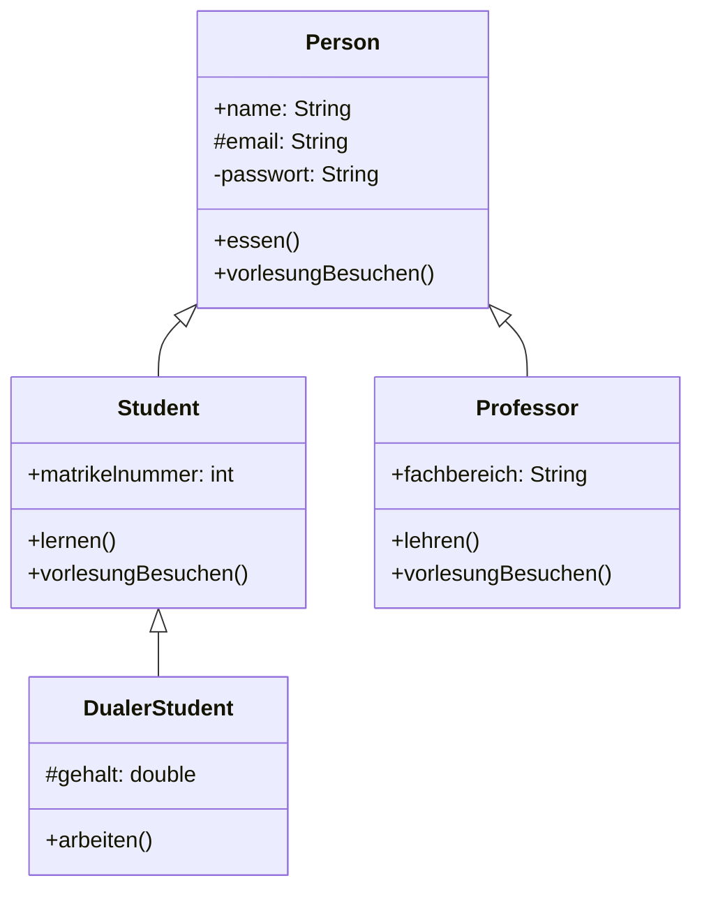
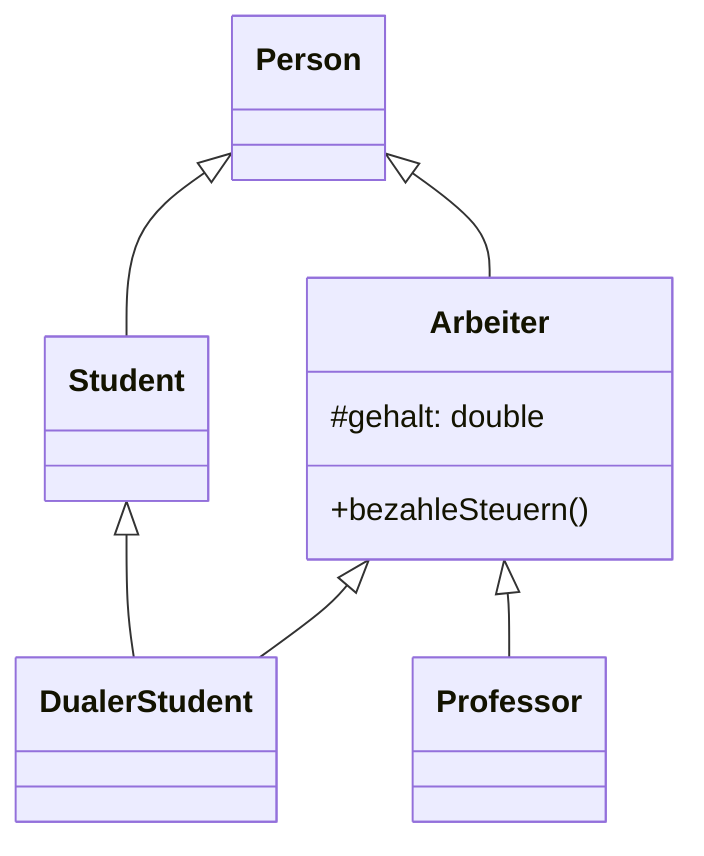
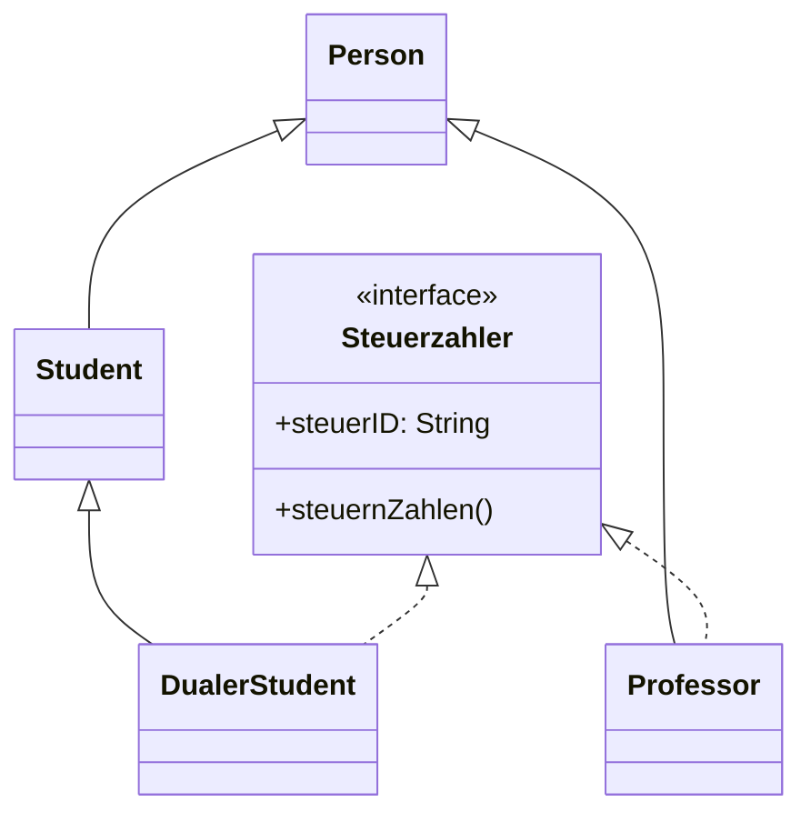
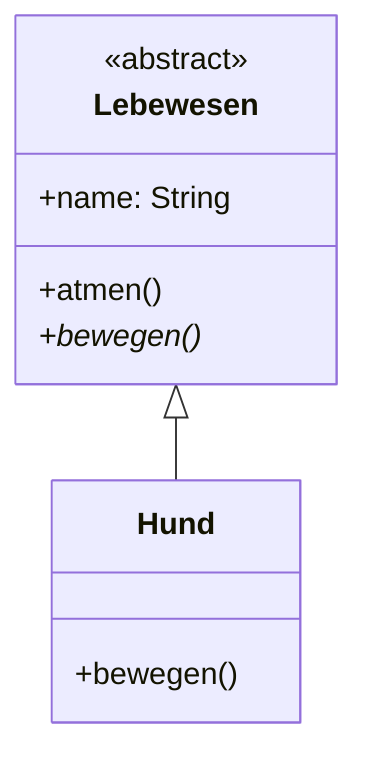

- Eigenschaften und Methoden einer Basisklasse an eine abgeleitete Klasse weitergeben
- Person ist die Oberklasse von Student und Professor (Generalisierung, vererbt)
- Student und Professor sind Unterklassen von Person (Spezialisierung, erbt)
- **Einfachvererbung:** Eine Klasse erbt von genau einer Basisklasse (Java)
- **Mehrfachvererbung:** Eine Klasse erbt von mehreren Basisklassen gleichzeitig (C++)




```java
public class Person {
    public String name;
    protected String email;
    private String passwort;

    public void essen() {
        System.out.println("Person isst.");
    }

    public void vorlesungBesuchen() {
        System.out.println("Person betritt den Hörsaal.");
    }
}

public class Student extends Person {
    public int matrikelnummer;

    public void lernen() {
        System.out.println("Student lernt.");
    }

    @Override
    public void vorlesungBesuchen() {
        super.vorlesungBesuchen();
        System.out.println("Student hört zu und schreibt mit.");
    }
}

public class Professor extends Person {
    public String fachbereich;

    public void lehren() {
        System.out.println("Professor lehrt.");
    }

    @Override
    public void vorlesungBesuchen() {
        super.vorlesungBesuchen();
        System.out.println("Professor hält die Vorlesung.");
    }
}

public class DualerStudent extends Student {
    protected double gehalt;

    public void arbeiten() {
        System.out.println("Dualer Student arbeitet im Unternehmen.");
    }
}

Person p;

// polymorpher Funktionsaufruf (Methodenauflösung erfolgt zur Laufzeit)
if (Hochschule == Uni)
	p = new Student();
if (Hochschule == DualeHochschule)
	p = new DualerStudent();
p.vorlesungBesuchen();
```

- `public` (`+`): Zugriff von überall möglich.
- `protected` (`#`): Zugriff innerhalb der Klasse, des Pakets und durch Unterklassen möglich.
- `private` (`-`): Zugriff nur innerhalb der eigenen Klasse möglich.
- (default): Zugriff nur innerhalb des eigenen Pakets (Package-private).

## 1.1 Interfaces

### 1.1.1 Problem: Mehrfachvererbung (ANTIPATTERN)



### 1.1.2 Lösung über Interfaces




```java
public interface Steuerzahler {
    void steuernZahlen();
}

public class Professor extends Person implements Steuerzahler {
    @Override
    public void steuernZahlen() {
        System.out.println("Professor zahlt Steuern.");
    }
}

public class DualerStudent extends Student implements Steuerzahler {
    @Override
    public void steuernZahlen() {
        System.out.println("Dualer Student zahlt Steuern.");
    }
}
```

>Interfaces haben keinen Code, nur einen Methodenrumpf

## 1.2 Abstrakte Klassen

- Klassen, von denen **kein Objekt** erzeugt werden kann (Instanziierung nicht möglich).
- Dienen als Vorlage für Unterklassen.
- Können **abstrakte Methoden** enthalten (Methoden ohne Rumpf, die in Unterklassen überschrieben werden müssen).



```java
public abstract class Lebewesen {
    public String name;

    public void atmen() {
        System.out.println("Lebewesen atmet.");
    }

    // Abstrakte Methode: muss von Unterklassen implementiert werden
    public abstract void bewegen();
}

public class Hund extends Lebewesen {
    @Override
    public void bewegen() {
        System.out.println("Hund läuft auf vier Pfoten.");
    }
}
```

## 1.3 Standard-Interfaces

Java bietet vordefinierte Interfaces für häufige Aufgaben:

### 1.3.1 Cloneable

- Markierungs-Interface (besitzt keine Methoden).
- Erlaubt die Nutzung von `Object.clone()`, um eine flache Kopie eines Objekts zu erstellen.

### 1.3.2 Comparable

- Wird genutzt, um eine natürliche Ordnung für Objekte festzulegen (z.B. für `Collections.sort()`).
- Methode: `int compareTo(T o)`

```java
public class Student implements Comparable<Student> {
    public int matrikelnummer;

    @Override
    public int compareTo(Student other) {
        return Integer.compare(this.matrikelnummer, other.matrikelnummer);
    }
}
```

### 1.3.3 Serializable

- Markierungs-Interface.
- Ermöglicht es, ein Objekt in einen Byte-Stream umzuwandeln (persistente Speicherung oder Netzwerkübertragung).
- Felder, die nicht serialisiert werden sollen, werden mit `transient` markiert.

```java
public class User implements Serializable {
    private String username;
    private transient String passwort; // wird nicht gespeichert
}
```

### 1.3.4 Konstanten in Interfaces

Interfaces können auch Konstanten definieren. Diese sind implizit immer `public static final`.

```java
public interface Konfiguration {
    int MAX_VERSUCHE = 3;
    String VERSION = "1.0.0";
}
```

Da Interfaces primär Verhalten (Methoden) definieren sollen, gilt das "Constant Interface Pattern" (Interfaces nur für Konstanten) heutzutage eher als **Antipattern**. Konstanten sollten stattdessen dort stehen, wo sie logisch hingehören (z.B. in der zugehörigen Klasse oder einem Enum).

## 1.4 Konstruktoren (Die Pizza-Logik)

Konstruktoren werden **nicht vererbt**. Jedes Kind braucht seinen eigenen "Bauplan"

**Beispiel:**
```java
class Pizza {
    String teig;
    Pizza(String teig) { this.teig = teig; }
}

class SalamiPizza extends Pizza {
    int salamiScheiben;

    SalamiPizza(String teig, int anzahl) {
        super(teig);
        this.salamiScheiben = anzahl;
    }
}

// Anwendung:
SalamiPizza meinePizza = new SalamiPizza("Dinkel", 10);
System.out.println(meinePizza.teig);
System.out.println(meinePizza.salamiScheiben);
```

